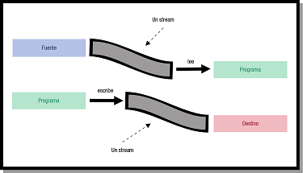

# 1 - Magatzems i fluxos de dades

En la major part de programes necessitem guardar informació de forma
permanent, de manera que perduren, encara que finalitze l'execució del
programa, o que servesquen de dades inicials. Els fitxers ens proporcionen la
forma més senzilla de guardar informació.

En el tema anterior vam veure com poder accedir tant a un directori com a un
fitxer, però no vam accedir al contingut d'aquestos. Dels fitxers només podíem
veure les seues característiques externes: nom, tipus, permisos, grandària,
... Però en cap moment vam accedir al seu contingut. Serà el que veurem en
aquest tema.

En un fitxer, com dèiem, quedarà guardada la informació de forma permanent.
Serà una **seqüència de bits** , un darrere de l'altre que representaran les
dades guardades, bé siguen caràcters d'un text, dades numériques, o els bytes
d'una imatge, per exemple. Aquesta seqüència de bits ens aporta una visió
estàtica de les dades, ja que queden guardades al llarg del temps.

Posant un exemple clàssic, els pantans i dipòsits on s'emmagatzema l'aigua
serien comparables als fitxers. Però per a nosaltres aquestos pantans i
dipòsits queden lluny. I quan parlem d'aigua corrent tenim més tendència a
pensar en les canonades i aixetes que ens porten aquesta aigua emmagatzemada
fins a nosaltres. Doncs de forma similar, des del punt de vista de
l’aplicació, el que realment cobra importància és la transferència de dades,
més que el magatzem, que arriben aquestes dades a l'aplicació o que
l'aplicació les puga transferir fins al fitxer. L’eina que ens permet
controlar aquestes transferències, de forma similar a les aixetes i canonades,
l’anomenem **flux de dades**. És un concepte associat a la transmissió
seqüencial d’una sèrie de dades des de l’aplicació al dispositiu
d’emmagatzematge o a l’inrevés. Ens dóna una visió eminentment dinàmica de la
informació.




Java utilitza els **streams** (fluxos de dades) per a poder accedir a la
informació. Però els _streams_ no limiten la transferència de dades d'un
fitxer, sinó que es generalitza per a qualsevol font de dades: memòria, xarxa,
fins i tot altres aplicacions. D'aquesta manera es generalitza l'accés a la
informació des de qualsevol procedència: si connectem un stream a un fitxer,
estarem accedint a un fitxer, però si connectem el stream a un altre programa
estarem accedint a les dades proporcionades per un altre programa. Intentarem
veure exemples d'accés a diferents fonts a través d'un stream, però ho
aplicarem sobretot a l'accés a fitxers, clar.

```Fluxos d'entrada i d'eixida```

La primera diferenciació que farem en els fluxos de dades és si són d'entrada
o d'eixida:

  * **Fluxos d'entrada** són aquells que serviran per introduir dades des de l'exterior al programa, és a dir a la zona de memòria controlada pel programa (variables, ...)
  * **Fluxos d'eixida** són aquells que serviran per a guardar les dades des de les variables del programa fins a l'exterior, per exemple un fitxer, per a que es guarden de forma permanent.

```Fluxos i tipus de dades```

Per mig del stream aconseguirem que una dada es guarde en un fitxer, o millor
dit una sèrie de dades. Quan guardem moltes dades, es compactaran unes al
costat de les altres (el que havíem comentat com a seqüenciació de bits). Si
intentem recuperar-les, haurem d'anar amb molt de compte amb la grandària de
cadascuna de les dades i el seu tipus. Anem a posar un exemple:

  * Suposem que volem guardar una dada numèrica en un enter (**int**). Els enters, en Java, es guarden en 32 bits. Si volem guardar el número **1.213.156.417** , ens quedarà en binari (els hem posat en grups de 8 bits, per facilitar la lectura):

               01001000 01001111 01001100 01000001

  * Suposem ara que volem guardar dos números enters, però del tipus **short** , que només ocupa 16 bits. El número 18.511 es representa en binari com 01001000 01001111, i el número 19.521 es representa 01001100 01000001. Si posem una dada darrere de l'altra (com es guardarà en un fitxer), el resultat serà:

               01001000 01001111 01001100 01000001

  * Suposem ara que volem guardar la paraula HOLA. Si guardem el codi ASCII de cada lletra tindrem: **H** (01001000), **O** (01001111),**L** (01001100) i **A** (01000001)

               01001000 01001111 01001100 01000001

En resum, les 3 informacions (el número de 32 bits, els 2 números de 16 bits,
i la paraula HOLA) es guarden de forma idèntica, com a seqüència de bits.

Per tant, l'única manera de poder recuperar la informació és saber de quin
tipus és i la mida, a banda de l'ordre com està guardada, clar. Els fluxos de
dades de Java transfereixen les dades de manera transparent al programador. No
cal indicar la quantitat de bits que cal transferir, sinó que es dedueix a
partir del tipus de dada que la variable representa. Però sempre haurem de
tenir present el tipus de dades i l'ordre.

Hi ha, però, una excepció amb el tipus _char_. La multitud d’estàndards de
codificació de caràcters existents en l’actualitat i la diversitat de formats
utilitzats a l’hora d’implementar les codificacions, usant segons el cas 8,
16, 32 bits o fins i tot una longitud variable en funció del caràcter a
representar, fan que siga molt difícil tractar aquest tipus de dades com una
simple seqüència de bytes.

Internament, Java representa el tipus caràcter amb una codificació UNICODE de
16 bits (UTF-16) per tal de suportar múltiples alfabets a banda de
l’occidental. Tot i així, és capaç de gestionar fonts de dades (fitxers entre
d’altres) de diverses codificacions (ASCII, ISO-8859, UTF-8, UTF-16…). En
funció de la codificació triada, el número de bits utilitzats en
l’emmagatzematge variarà. Es fa necessari, doncs, un tractament especial a
l’hora de manipular aquestes dades. Com veurem, Java disposa d’una jerarquia
específica de classes orientades a fluxos de caràcters per tal de fer aquestos
canvis i transformacions totalment transparents al programador.


Llicenciat sota la  [Llicència Creative Commons Reconeixement NoComercial
CompartirIgual 2.5](http://creativecommons.org/licenses/by-nc-sa/2.5/)

