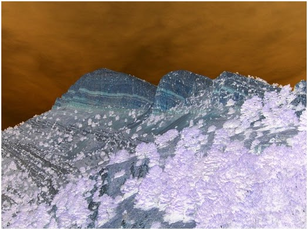
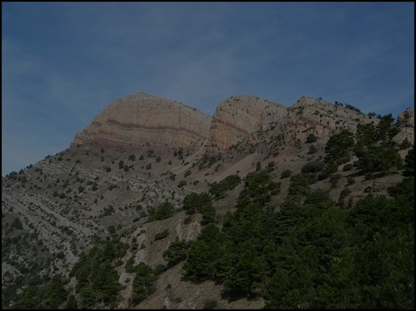
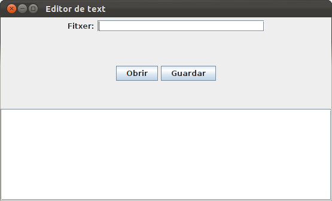
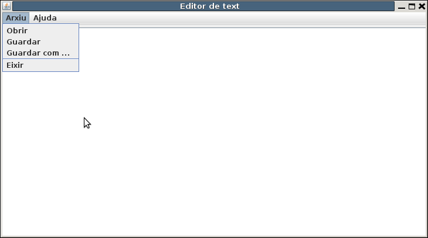

# Exercicis

##  Exercici T2_1

Aquest primer exercicis és per a tractament de bytes, ja que es tractarà de
modificar una imatge. Per a poder provar-lo podeu utilitzar la imatge
**Penyagolosa.bmp** que se us proporciona en l'aula virtual i l'heu de copiar
al directori arrel del projecte **Tema2** per a un funcionament més còmode.

**No es pretén construir un editor d'imatges. Tan sols pretenem agafar la
informació del fitxer byte a byte, realitzar alguna transformació en els bytes
i guardar-la en un altre fitxer.**

El format d'un fitxer **bmp** , aproximadament és el següent:

  * En els 54 primers bytes es guarda informació diversa, com la grandària de la imatge, paleta de colors, ...
  * A partir d'ahí es guarda **cada punt** de la imatge com **3 bytes** , un per al roig (R), un per al verd (G) i i un per al blau (B), anant d'esquerra a dreta i de dalt a baix.

Copia't i modifica la classe **FitxerImatge** en el paquet **exercicis** ,
creant els mètodes oportuns seguint aquestes pautes:

  * El constructor **FitxerImatge(File fEnt)** ha d'inicialitzar la propietat **f** (**File**) **si i només si** existeix el fitxer i l'extensió del fitxer és **.bmp** (ho controlarem senzillament perquè el nom del fitxer acaba així). En cas contrari, traure els missatges d'error oportuns per l'eixida estàndar.
  * Els mètodes de transformació (**transformaNegatiu** ,**transformaObscur** i el voluntari **transformaBlancNegre**) han de crear un nou fitxer que contindrà la imatge transformada com veurem més avant. El nom del nou fitxer s'ha de formar a partir del nom del fitxer d'entrada, el que hem guardat en el constructor. Serà sempre posant abans del .bmp un guió baix i un identificatiu de la transformació realitzada: **_n** per al negatiu, **_o** per a l'obscur i **_bn** per al blanc i negre (part voluntària). És a dir, si el fitxer d'entrada fóra **imatge1.bmp** , el d'eixida haurà de ser: 
    * **imatge1_n.bmp** per al mètode **transformaNegatiu**
    * **imatge1_o.bmp** per al mètode **transformaObscur**
    * **imatge1_bn.bmp** per al mètode voluntari **transformaBlancNegre******
  * En cada transformació, els primers 54 bytes s'han de copiar sense modificar: s'han d'escriure en el fitxer de destí tal i com s'han llegit del fitxer d'entrada
  * A partir del 54, cada vegada que es llegirà un byte, s'haurà de transformar abans d'escriure'l en el destí. La transformació és d'aquesta manera: 
    * Per al **negatiu** (**transformaNegatiu**), cada byte de color (RGB) de cada punt, s'ha de transformar en el complementari. Com estem parlant de bytes però que en llegir els guardem en enters, senzillament serà calcular **255 - b** (si b és el byte llegit).
    * Per a l'**obscur** (**transformaObscur**), cada byte de color (RGB) de cada punt, s'ha de baixar d'intensitat a la meitat. Senzillament serà calcular **b / 2** (si b és el byte llegit).
    * Per al **blanc i negre** (**transformaBlancNegre**), que és el voluntari, hem de donar el mateix valor per al roig, el blau i el verd (RGB) de cada punt, i així aconseguirem un gris d'intensitat adequada. Una bona manera serà**llegir els tres bytes** de cada punt (**no s'aconsella utilitzar una lectura amb un array de 3 posicions** ; millor fer tres lectures guardades en tres variables diferents), **calcular la mitjana** d'aquestos 3 valors, i **escriure el resultat 3 vegades** en el fitxer de destí.
    * En cap dels casos anteriors es recomana la lectura dels bytes en un ByteArray, perquè podeu tenir resultats imprevisibles a causa de la interpretació numèrica (i per tant amb signe, cosa que en aquest cas no té sentit, ja que han són números del 0 al 255). **Es recomana vivament llegir byte a byte**.

A mode orientatiu del que es vol fer, us adjunte la classe **FitxerImatge** a
la qual heu de modificar el constructor i els tres mètodes de transformació
(l'últim és voluntari). Recordeu que ha d'anar al paquet **exercicis**.****

    
    
    package exercicis
    
    import java.io.File
    
    class FitxerImatge(fEnt: File) {
    	var f: File = File("")   // No modifiqueu aquesta línia. El seu valor s'ha de modificar en el constructor
    
    	init {
    		// Constructor
    		// Control d'existència del fitxer i control de l'extensió .bmp (traure missatges d'error)
            // En cas que tot siga correcte, inicialitzar f amb fEnt
     
    	}
    
    	fun transformaNegatiu() {
    		// Transformar a negatiiu i guardar en _n.bmp
    
    	}
    
    	fun transformaObscur() {
    		// Transformar a una imatge més fosca i guardar en _o.bmp
    
    	}
    	
    	/* Partvoluntària
    	fun transformaBlancNegre() {
    		// Transformar a una imatge en blanc i negre i guardar en _bn.bmp
    
    	}
     */
    }

Aquest seria un exemple de programa principal, que podeu utilitzar si voleu.
Recordeu que ha d'anar al paquet **exercicis** i li podeu donar el nom
**Exercici_2_1.kt****.**

    
    
    package exercicis
    
    import java.io.File
    
    fun main(args: Array<String>){
    	val f = File("Penyagolosa.bmp")
    	
    	val fi = FitxerImatge(f)
    	fi.transformaNegatiu()
    	fi.transformaObscur()
    	//voluntari
    	//fi.transformaBlancNegre()
    }

  
  

Per a la imatge que se us proporciona (i que està en la construcció del File
del programa principal), que és la de l'esquerra, haurien d'eixir les de la
dreta:

**Imatge inicial** | **negatiu** | **obscur** | **blanc i negre (voluntari)**  
---|---|---|---  
 |  |  |   
**Penyagolosa.bmp** | **Penyagolosa_n.bmp** | **Penyagolosa_o.bmp** | **Penyagolosa_bn.bmp**  
  

##  Exercici T2_2

Aquest programa serà el primer que utilitzarà components gràfics.

Per a entendre els components gràfics de la llibreria **Swing** i els
contenidors de la llibreria **Awt** , que són els que utilitzarem, us
aconselle que us mireu l'annex **Gràfics en Java: llibreries** **AWT i
SWING******que teniu en la secció d'annexos, al final del curs de Moodle. De
tota manera, us proporcione "l'esquelet" del programa, i només us demane que
feu les sentències de quan s'apreten els botons d'obrir i de guardar.

Anem a fer un senzill editor de text amb el següent aspecte:

En el JTextField de dalt posarem el nom (i ruta) del fitxer.

  * Quan apretem al botó **Obrir** ha de bolcar el contingut del fitxer al **JTextArea**(controlant prèviament que existeix el fitxer).
  * Quan apretem a **Guardar** , ha de bolcar el contingut del**JTextArea** en el fitxer (el nom del qual tenim en el **JTextField**).****

L'esquelet del programa és el que trobareu a continuació. He utilitzat la
filosofia de l'annex, que consisteix a tenir al final de tot el programa
principal (el main) que invoca amb posterioritat (**invokeLater******) una
funció que crea l'objecte de la classe que hereta de**JFrame** , que és
realment la finestra, i la fa visible.

Una vegada copiat en el paquet **exercicis** del projecte **Tema2** per
exemple amb el nom **Exercici_2_****2.kt** , només heu de completar el que
teniu al final de tot d'aquesta classe on estan els comentaris, és a dir els
mètodes **addActionListener** dels botons **obrir** i **guardar**

    
    
    package exercicis
    
    import javax.swing.*
    import java.awt.*
    
    class Exercici_2_2_Pantalla : JFrame() {
    	val et_f = JLabel("Fitxer:")
    	val fitxer = JTextField(25)
    	val obrir = JButton("Obrir")
    	val guardar = JButton("Guardar")
    	val et_a = JLabel("Contingut:")
    	val area = JTextArea(10, 50)
    	val scrollPane = JScrollPane(area)
    
    	// en iniciar posem un contenidor per als elements anteriors
    	init {
    		defaultCloseOperation = JFrame.EXIT_ON_CLOSE
    
    		setLayout(GridLayout(2, 1))
    		setTitle("Editor de text")
    
    		val panell1 = JPanel(GridLayout(0, 1))
    		val panell1_1 = JPanel(FlowLayout())
    		panell1.add(panell1_1)
    		panell1_1.add(et_f)
    		panell1_1.add(fitxer)
    
    		val panell1_2 = JPanel(FlowLayout())
    		panell1.add(panell1_2)
    		panell1_2.add(obrir)
    		panell1_2.add(guardar)
    		val panell2 = JPanel(GridLayout(0, 1))
    		panell2.add(scrollPane)
    		area.setEditable(true)
    
    		add(panell1)
    		add(panell2)
    		pack()
    		
    		obrir.addActionListener {
    		// Instruccions per a bolcar el contingut del fitxer en el JTextArea
    			
    		}
    		
    		guardar.addActionListener {
    		// Instruccions per a guardar el contingut del JTextArea al fitxer.
    				
    		}
    	}
    }
    
    private fun crearMostrarFinestra() {
    
    	val frame = Exercici_2_2_Pantalla()
    	frame.isVisible = true
    }
    
    fun main(args: Array<String>) {
    	EventQueue.invokeLater(::crearMostrarFinestra)
    }

<!--

##  Exercici T2_3. Voluntari

Com a exercici voluntari us propose una altra versió del Editor de Text de
l'anterior exercici.

Ara serà únicament un JTextArea, i les opcions les tindrem en menú. Utilitzeu
el component **JFileChooser** per a buscar fitxers i per a guardar-los que ens
proporciona **Swing**. Ja teniu implementada l'opció d'eixir.

Si teniu temps i ganes, afegiu un component baix de tot per a triar la
codificació entre **UTF-8** i **ISO-8859-15**

Aquest seria l'esquelet del programa principal i la classe que implementa
JFrame. El podeu guardar per exemple en **Exercici_2_3.kt** :

    
    
    package exercicis
    
    import javax.swing.*
    import java.awt.*
    import java.io.File
    
    class Exercici_2_3 : JFrame() {
    	val area = JTextArea()
    	val scrollPane = JScrollPane(area)
    
    	val menu_p = JMenuBar()
        
        val menu_arxiu = JMenu("Arxiu")
        val menu_ajuda = JMenu("Ajuda")
        
        val obrir = JMenuItem("Obrir")
        val guardar = JMenuItem("Guardar")
        val guardarCom = JMenuItem("Guardar com ...")
        val eixir = JMenuItem("Eixir")
    
        val quantA = JMenuItem("Quant a Editor")
        
        val fCh = JFileChooser()
    
    	// en iniciar posem un contenidor per als elements anteriors
    	init {
    		defaultCloseOperation = JFrame.EXIT_ON_CLOSE
    
    		setLayout(BorderLayout())
    		setTitle("Editor de text més avançat")
    		add(scrollPane)
    		area.setEditable(true)
    
    		setSize(750, 400)
            setJMenuBar(menu_p)
    
            menu_p.add(menu_arxiu)
            menu_p.add(menu_ajuda)
            
            menu_arxiu.add(obrir)
            menu_arxiu.add(guardar)
            menu_arxiu.add(guardarCom)
            menu_arxiu.add(JSeparator())
            menu_arxiu.add(eixir)
            
            menu_ajuda.add(quantA);
    
    		obrir.addActionListener { obrir() }
    
    		guardar.addActionListener { guardar() }
    
    		guardarCom.addActionListener { guardarCom() }
    
    		eixir.addActionListener { eixir() }
    
    		quantA.addActionListener { quantA() }
    	}
    
    	fun obrir() {
    		// Instruccions per a obrir un fitxer i posar el contingut en el JTextArea
    
    	}
    
    	fun guardar() {
    		// Instruccions per a guardar el contingut del JTextArea al fitxer.
    
    	}
    
    	fun guardarCom() {
    		// Instruccions per a guardar el contingut del JTextArea al fitxer, amb la possibilitat de canviar el nom
    
    	}
    
    	fun eixir() {
    		// Instruccions per a eixir
    		System.exit(0)
    	}
    
    	fun quantA() {
    		// Instruccions per a mostrar un diàleg amb la versió (Acerca de...)
    
    	}
    }
    
    
    fun main(args: Array<String>) {
    	EventQueue.invokeLater( { Exercici_2_3().isVisible = true })
    }  
 -->   

Llicenciat sota la  [Llicència Creative Commons Reconeixement NoComercial
CompartirIgual 2.5](http://creativecommons.org/licenses/by-nc-sa/2.5/)

