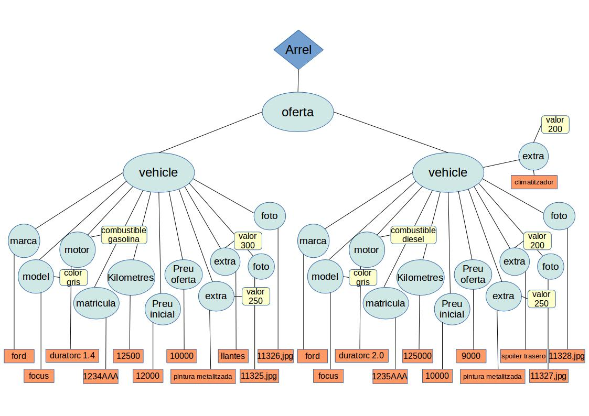
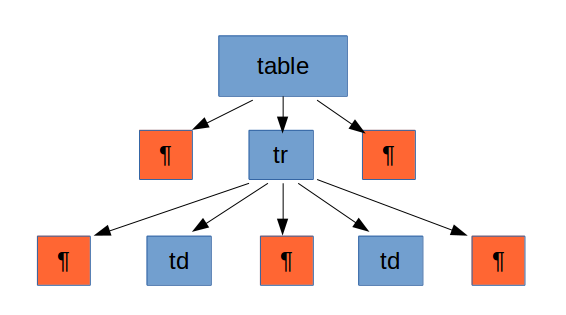
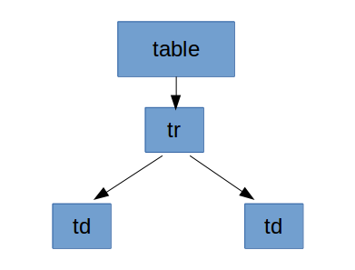

# 4.2 - L'estructura DOM

L’estructura DOM pren la forma d’un arbre, on cada part del XML es trobarà
representada en forma de **node**. En funció de la posició en el document XML,
parlarem de diferents tipus de nodes:

  * El node principal que representa tot el XML sencer s’anomena **Document.**
  * Les diverses etiquetes, inclosa l’etiqueta arrel, es coneixen com a nodes **Element**.
  * El contingut d’una etiqueta de tipus text, serà un node de tipus **TextElement**
  * Els atributs seran nodes de tipus **Attribute**.

En l'exemple de la pàgina anterior, el fitxer **cotxes.xml** , que té aquesta
estructura:
```xml
<?xml version="1.0" encoding="UTF-8"?>
<oferta>
    <vehiculo>
        <marca>ford</marca>
        <modelo color="gris">focus</modelo>
        <motor combustible="gasolina">duratorc 1.4</motor>
        <matricula>1234AAA</matricula>
        <kilometros>12500</kilometros>
        <precio_inicial>12000</precio_inicial>
        <precio_oferta>10000</precio_oferta>
        <extra valor="250">pintura metalizada</extra>
        <extra valor="300">llantas</extra>
        <foto>11325.jpg</foto>
        <foto>11326.jpg</foto>
    </vehiculo>
    <vehiculo>
        <marca>ford</marca>
        <modelo color="gris">focus</modelo>
        <motor combustible="diesel">duratorc 2.0</motor>
        <matricula>1235AAA</matricula>
        <kilometros>125000</kilometros>
        <precio_inicial>10000</precio_inicial>
        <precio_oferta>9000</precio_oferta>
        <extra valor="250">pintura metalizada</extra>
        <extra valor="200">spoiler trasero</extra>
        <extra valor="500">climatizador</extra>
        <foto>11327.jpg</foto>
        <foto>11328.jpg</foto>
    </vehiculo>
</oferta>
```

Veient-lo com una estructura jeràrquica ens quedaria així:



On:

  * El node **Document** és el rombe
  * Els nodes **Element** són els cercles
  * Els nodes **TextElement** són els rectàngles de fons taronja.
  * Els nodes **Attribute** són els rectàngles arrodonits de color groc

Cada node específic disposa de mètodes per accedir a les seues dades concretes
(nom, valor, nodes fills, node pare, etc.). És a dir, que el **node** serveix
per a situar-se en una determinada posició (element, atribut, element de text,
...). Tindrà uns mètodes, sobretot per a navegar, encara que també alguns per
a traure el contingut. **Element** és un classe derivada de **Node** (per tant
hereta tots els seus mètodes), i proporciona algunes coses més, sobretot per a
accedir còmodament a les seues parts. Mirem els mètodes més importants, tant
de**Node** com de **Element** i **Document**

**Mètodes de NODE**

Valor tornat | Mètode | Descripció  
---|---|---  
String | **getNodeName()** | torna el nom d'aquest node  
short | **getNodeType()** | torna el tipus d'aquest node (ELEMENT_NODE, ATTRIBUTE_NODE, TEXT_NODE, ...  
String | **getNodeValue()** | torna el valor del node, si en té  
NodeList | **getChildNodes()** | torna una llista amb els nodes fills  
Node | **getFirstChild()** | torna el primer fill  
Node | **getLastChild()** | torna l'últim fill  
NamedNodeMap | **getAttributes()** | torna una llista amb els atributs del node (null si no en té cap)  
Node | **getParentNode()** | torna el pare  
String | **getTextContent()** | torna el text contingut en l'element i el de tots els seus descendents, si en té  
boolean | **hasChildNodes()** | torna cert si el node té algun fill  
boolean | **hasAttributes()** | torna cert si el node té algun atribut  
  
Mètodes d' **ELEMENT**

Valor tornat | Mètode | Descripció  
---|---|---  
String | **getAttribute(** String nom**)** | torna el valor de l'atribut que té aquest nom  
NodeList | **getElementsByTagName(** String nom**)** | torna una llista de nodes amb tots els descendents que tenen aquest nom  
boolean | **hasAttribute(** String nom**)** | torna cert si l'element té aquest atribut  
  
**Mètodes de DOCUMENT**

Valor tornat | Mètode | Descripció  
---|---|---  
Element | **getDocumentElement()** | torna l'element arrel del document  
NodeList | **getElementsByTagName(** String nom**)** | torna una llista de nodes amb tots els descendents que tenen aquest nom  
  
<u>**Nota**</u>
<div style="background-color: #d6eaf8; color: black; padding: 5px;">
Kotlin ens "suggerirà" canviar molts dels mètodes anteriors per propietats.
Per exemple per al mètode <b>getNodeName()</b> ens suggerirà de canviar-lo per la
propietat <b>nodeName</b>. Podeu substituir per la propietat o deixar el mètode,
el que vulgueu.
</div>
<p></p>
Sempre que tinguem una**llista de nodes** , podrem accedir a cadascun dels
membres de la llista amb el mètode **item** especificant el número d'ordre.
Així, si volem accedir al primer posarem **item(0)**

Posterioment posarem els mètodes que serveixen per anar posant contingut a un
document: crear fills, crear atributs, posar contingut, ...

El DOM resultant obtingut des d’un XML acaba sent un còpia exacta del fitxer,
però disposat de diferent manera. Tant al XML com al DOM hi haurà informació
no visible, com ara els _retorns de carro_ , que cal tenir en compte per tal
de saber processar correctament el contingut i evitar sorpreses poc
comprensibles.

Per a il·lustrar el problema que poden suposar els retorn de carro, imaginem
que disposem d’un document XML amb el següent contingut:
```xml
<table>
  <tr>
    <td> </td>
    <td> </td>
  </tr>
</table>
```
Veurem més clar si representem els retorn de carro en el mateix document:
```xml
<table>¶
  <tr>¶
    <td> </td>¶
    <td> </td>¶
  </tr>¶
</table>
```

A la següent figura es mostra la representació que tindria l’objecte DOM, un
vegada estiga ja copiat en memòria. Observeu com l’element **table** tindrà
tres fills. En un es guardarà el **retorn de carro** que situa l’etiqueta 
**_< tr >_** a la següent línia, en el segon trobarem l’etiqueta **_< tr >_**, i en
el tercer el retorn de carro que fa que **_</ table >_** estiga en la línia de
baix. El mateix passa amb els fills de **_< tr >_**, abans i després de cada
node **_< td >_** trobarem un **retorn de carro**.

  


En canvi, si haguérem partit d'un XML equivalent però sense retorns de carro,
el resultat hauria estat diferent:
```xml
<table><tr><td></td><td></td></tr></table>
```


L’absència de retorns de carro en el fitxer implica també l’absència de nodes
contenint els retorns de carro en l’estructura DOM.

Un altre aspecte a tenir en compte és que el contingut de les etiquetes es
plasma en el DOM com un node fill de l’etiqueta contenidora. És a dir, per
obtenir el text d’una etiqueta cal obtenir el primer fill d’aquesta.
```xml
<aaa>
  <bbb>
    text de l'etiqueta bbb
  </bbb>
</aaa>
```


Llicenciat sota la  [Llicència Creative Commons Reconeixement NoComercial
CompartirIgual 2.5](http://creativecommons.org/licenses/by-nc-sa/2.5/)

