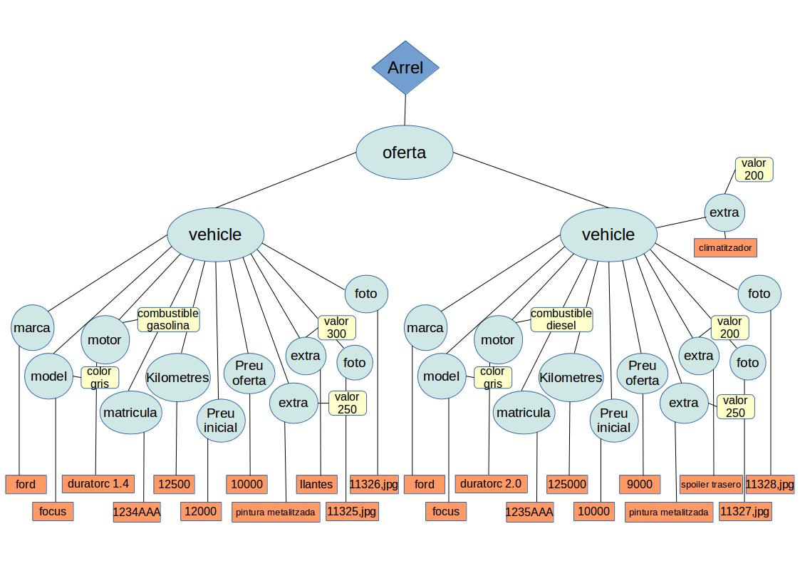

# 4.- Documents XML

Hem vist que la manera més còmoda de guardar objectes és amb la seriació, per
mig del **ObjectInputStream** i **ObjectOutputStream** , però que **fora** de
Java o de Kotlin **no és possible** l'accés a aquestes dades. I com havíem
comentat en l'última nota de la pregunta anterior, també dins de Kotlin podem
tenir problemes, perquè el nom de la classe amb el nom del paquet es guarda en
el fitxer com a metades, i en un altre programa haurem de tenir la classe
creada en un paquet amb el mateix nom, sinó no es podran recuperar les dades.
I fins i tot dient-se exactament igual, poden haver problemes si el
**serialVersionUID** de la classe no és el mateix.

També hem vist que per a guardar dades individuals de diferents tipus ens van
molt bé les classes **DataInputStream** i **DataOutputStream** , però haurem
de saber molt bé l'ordre i tipus de dades que estan guardades, sinó, no les
podrem recuperar.

I no entrem ja en la possibilitat que diferents Sistemes Operatius representen
la informació de forma diferent (per exemple, hi ha Sistemes Operatius que
representen els números amb BCD i altres que utilitzen complement a 2).

Per tant, quan vulguem guardar dades que puguen ser llegides per aplicacions
fetes en diferents llenguatges i/o executades en diferents plataformes, ens
farà falta un format estàndar que tots el puguen entendre i reconéixer, i
millor si és autoexplicatiu com és el cas dels**llenguatges de marques**.

El llenguatge de marques més conegut i més utilitzat és el **XML**
(_**eXtensible Markup Language**_)

Els documents XML aconsegueixen estructurar la informació intercalant unes
marques anomenades etiquetes, cada etiqueta amb un principi i un final, i que
poden anar unes dins d'unes altres, i també contenir informació de text.
D’aquesta manera, es podrà subdividir la informació estructurant-la de forma
que puga ser fàcilment interpretada.

Tota la informació serà de text, i per tant no hi haurà el problema mencionat
abans de representar les dades de diferent manera. Qualsevol dada, ja siga
numèrica, booleana o com siga, es posarà en mode text, i per tant sempre es
podrà llegir i interpretar correctament tota la informació continguda en un
fitxer XML.

És cert que els caràcters es poden escriure utilitzant diferents sistemes de
codificació, però XML ofereix diverses tècniques per evitar que això siga un
problema, com per exemple, incloent a la capçalera del fitxer quina
codificació s’ha fet servir en el moment de guardar-lo.

Amb les etiquetes, XML aconsegueix estructurar qualsevol tipus d’informació
jeràrquica. Es pot establir certa similitud entre la forma com la informació
es guarda en els objectes d’una aplicació i la forma com es guardaria en un
document XML. La informació, en les aplicacions orientades a objectes,
s’estructura, agrupa i jerarquitza en classes, i en els documents XML
s’estructura, organitza i jerarquitza en etiquetes contingudes unes dins les
altres i atributs de les etiquetes.


Imaginem que volem representar les dades dels empleats com els de l’aparat
anterior utilitzant un format XML. No existeix una única solució, però és
obligatori que totes respecten la jerarquia del model. Un possible format
podria ser el següent:
```xml
<empresa>  
    <empleat>  
        <num>1</num>
        <nom>Andreu</nom>  
        <departament>10</departament>  
        <edat>32</edat>  
        <sou>1000.0</sou>
    </empleat>

    <empleat>  
        <num>2</num>
        <nom>Bernat</nom>  
        <departament>20</departament>  
        <edat>28</edat>  
        <sou>1200.0</sou>
    </empleat>

    <empleat>  
        <num>3</num>
        <nom>Clàudia</nom>  
        <departament>10</departament>  
        <edat>26</edat>  
        <sou>1100.0</sou>
    </empleat>
 
    <empleat>  
        <num>4</num>
        <nom>Damià</nom>  
        <departament>10</departament>  
        <edat>40</edat>  
        <sou>1500.0</sou>
    </empleat>
</empresa>
```
Però aquesta també podria ser una manera de representar-lo:
```xml
<empresa>  
    <empleat num='1' nom='Andreu' departament='10' edat='32' sou='1000.0'/>
    <empleat num='2' nom='Bernat' departament='20' edat='28' sou='1200.0'/>
    <empleat num='3' nom='Clàudia' departament='10' edat='26' sou='1100.0'/>
    <empleat num='4' nom='Damià' departament='10' edat='40' sou='1500.0'/>
</empresa>
```
I podem imaginar moltes altres solucions, combinant considerant com atributs o
subetiquetes les diferents característiques dels empleats que volem guardar.
Aquest seria el problema principal del XML, les múltiples solucions. Però
també és veritat que totes elles són fàcils d'entendre.

## 4.1 - Parser o analitzador XML

Un **_Parser_ XML** és una classe que ens permet analitzar i classificar el
contingut d’un arxiu XML extraient la informació continguda en cada una de les
etiquetes, i relacionar-la d’acord amb la seua posició dins la jerarquia.

Hi ha dos tipus d'analitzadors depenent de la manera de funcionar.

```Analitzadors seqüencials```

Els **analitzadors seqüencials** permeten extreure el contingut a mida que es
van descobrint les etiquetes d’obertura i tancament. També s’anomenen
**analitzadors sintàctics**. Són analitzadors molt ràpids, però presenten el
problema que cada vegada que es necessita accedir a una part del contingut,
s'ha de rellegir tot el document de dalt a baix.

En Java, l’analitzador sintàctic més popular s’anomena **SAX** , que vol dir
**Simple API for XML**. És una analitzador molt utilitzat en diverses
biblioteques de tractament de dades XML, però no sol utilitzar-se en
aplicacions finals, pel problema abans comentat d'haver de llegir-se tot el
document XML a cada consulta. Per aquesta raó no els veurem en aquest curs.

```Analitzadors jeràrquics```

Generalment, les aplicacions finals que han de treballar amb dades XML solen
utilitzar analitzadors jeràrquics.

Els **analitzadors jeràrquics** guarden totes les dades del document XML en
memòria dins una estructura jeràrquica, a mida que van analitzant el seu
contingut. I per això són ideals per a aplicacions que requereixen una
consulta contínua de les dades.

El**format de l’estructura** on es guarda la informació en memòria ha estat
especificat per l’organisme internacional W3C (World Wide Web Consortium) i es
coneix com a **DOM** (_**Document Object Model**_). És una estructura que HTML
i javascript han popularitzat molt i es tracta d’una especificació que Java
materialitza en forma d’interfícies. La principal s’anomena **_Document_** i
representa tot un document XML. En tractar-se d’una interfície, pot ser
implementada per diverses classes.

L’estàndard W3C defineix la classe **DocumentBuilder** (constructor de
documents) per a poder crear estructures DOM a partir d’un XML. Aquesta classe
**DocumentBuilder** és una classe abstracta, i per tal que es puga adaptar a
les diferents plataformes, pot necessitar fonts de dades o requeriments
diversos. Recordeu que les classes abstractes no es poden instanciar de forma
directa. Per aquest motiu, el consorci W3 especifica també la classe
**DocumentBuilderFactory** , és a dir, el  _fabricador_ de  _DocumentBuilder_.

Les llibreries des d'on importarem les classes comentades són:

  * **DocumentBuilderFactory** i **DocumentBuilder** les importarem de la llibreria **javax.xml.parsers.***
  * **Document** l'importarem de **org.w3c.dom.***

Hem de cuidar sobretot aquesta última importació, perquè per defecte Java ens
ofereix moltes llibreries des d'on importar **Document**. I si no la importem
de la llibreria correcta, evidentment després tindrem errors.

Les instruccions necessàries per llegir un fitxer XML i crear un objecte
**Document** serien les següents:

       
    import java.io.FileInputStream
    
    import javax.xml.parsers.DocumentBuilder
    import javax.xml.parsers.DocumentBuilderFactory
    
    import org.w3c.dom.Document
    
    ...
    
        val dbFactory = DocumentBuilderFactory.newInstance()
    
        val dBuilder = dbFactory.newDocumentBuilder()
    
        val doc = dBuilder.parse(File(“fitxer.xml”))

Tornem a insistir en la necessitat d'importar **Document** de la llibreria
**org.w3c.dom.***

Anem a basar-nos en un exemple per poder veure a poc a poc la manera
d'utilitzar el parser. És un exemple que possiblement es va veure en primer,
en el mòdul de Llenguatge de Marques. Suposarem que està en el fitxer
**cotxes.xml** , i que està en el directori del projecte on farem les proves.
```xml
<?xml version="1.0" encoding="UTF-8"?>
<oferta>
    <vehiculo>
        <marca>ford</marca>
        <modelo color="gris">focus</modelo>
        <motor combustible="gasolina">duratorc 1.4</motor>
        <matricula>1234AAA</matricula>
        <kilometros>12500</kilometros>
        <precio_inicial>12000</precio_inicial>
        <precio_oferta>10000</precio_oferta>
        <extra valor="250">pintura metalizada</extra>
        <extra valor="300">llantas</extra>
        <foto>11325.jpg</foto>
        <foto>11326.jpg</foto>
    </vehiculo>
    <vehiculo>
        <marca>ford</marca>
        <modelo color="gris">focus</modelo>
        <motor combustible="diesel">duratorc 2.0</motor>
        <matricula>1235AAA</matricula>
        <kilometros>125000</kilometros>
        <precio_inicial>10000</precio_inicial>
        <precio_oferta>9000</precio_oferta>
        <extra valor="250">pintura metalizada</extra>
        <extra valor="200">spoiler trasero</extra>
        <extra valor="500">climatizador</extra>
        <foto>11327.jpg</foto>
        <foto>11328.jpg</foto>
    </vehiculo>
</oferta>
```
El primer que farem serà intentar connectar amb aquest fitxer, però d'una
forma un poc més reduïda que abans, sense definir objectes del
**DocumentBuilderFactory** ni **DocumentBuilder**. Tampoc ens caldrà definir-
nos el **File** (**FileInputStream**) ja que el mètode **parse** també agafa
un **String** com a paràmetre:

    
    
    import javax.xml.parsers.DocumentBuilderFactory
    
    import org.w3c.dom.Document
    
    ...
    
        val doc = DocumentBuilderFactory.newInstance().newDocumentBuilder().parse("cotxes.xml")

Però, i si el procés que necessitem és l'invers? És a dir, i si el que volem
és guardar una estructura DOM en un fitxer XML?

En aquest cas el que haurem de fer serà construir un **document buit** , anar
posant els elements i atributs (amb els seus valors) d'alguna manera, i
posteriorment guardar-lo en un fitxer. Deixem per a un poc més avant com anar
construint els nodes del document i centrem-nos en el fet de crear el document
buit i guardar-lo en un fitxer. Podem construir un document nou a partir del
**DocumentBuilder** , utilitzant el mètode **newDocument()** :

    
    
    import javax.xml.parsers.DocumentBuilderFactory
    
    import org.w3c.dom.Document
    
    ...
    
        val doc1 = DocumentBuilderFactory.newInstance().newDocumentBuilder().newDocument()

Per a escriure la informació continguda al DOM a un fitxer, es pot fer
utilitzant una altra utilitat de Java anomenada **_Transformer_**. Es tracta
d’una utilitat que permet realitzar fàcilment conversions entre diferents
representacions d’informació jeràrquica. És capaç, per exemple, de passar la
informació continguda en un objecte **Document a un fitxer de text en format
XML**. També seria capaç de fer l’operació inversa, però no val la pena perquè
el mateix _DocumentBuilder_ ja s’encarrega d’això.

**_Transformer_** és també una classe abstracta i requereix d’una _factory_
per poder ser instanciada. La classe **Transformer** pot treballar amb
multitud de contenidors d’informació perquè en realitat treballa amb un parell
de tipus adaptadors (classes que fan compatibles jerarquies diferents) que
s’anomenen **Source** i **Result**. Les classes que implementen aquestes
interfícies s’encarregaran de fer compatible un tipus de contenidor específic
al requeriment de la classe **Transformer**. Així, disposem de les classes
**DOMSource** , **SAXSource** o **StreamSource** com a adaptadors del
contenidor de la font d’informació (DOM, SAX o Stream respectivament).
**DOMResult** , **SAXResult** o **StreamResult** són els adaptadors
equivalents del contenidor destí. A nosaltres ara, com que volem passar un
document DOM a un fitxer, ens convindrà un **DOMSource** i un **StreamResult**

El codi bàsic per realitzar una transformació de DOM a fitxer de text XML
seria el següent:

    
    
    val trans = TransformerFactory.newInstance().newTransformer()
    
    val source = DOMSource(doc)
    val result = StreamResult(file)
    
    trans.transform(source, result)

De tota manera, veurem més avant un exemple on ens guardarem una estructura
DOM en un fitxer XML.

## 4.2 - L'estructura DOM

L’estructura DOM pren la forma d’un arbre, on cada part del XML es trobarà
representada en forma de **node**. En funció de la posició en el document XML,
parlarem de diferents tipus de nodes:

  * El node principal que representa tot el XML sencer s’anomena **Document.**
  * Les diverses etiquetes, inclosa l’etiqueta arrel, es coneixen com a nodes **Element**.
  * El contingut d’una etiqueta de tipus text, serà un node de tipus **TextElement**
  * Els atributs seran nodes de tipus **Attribute**.

En l'exemple de la pàgina anterior, el fitxer **cotxes.xml** , que té aquesta
estructura:
```xml
<?xml version="1.0" encoding="UTF-8"?>
<oferta>
    <vehiculo>
        <marca>ford</marca>
        <modelo color="gris">focus</modelo>
        <motor combustible="gasolina">duratorc 1.4</motor>
        <matricula>1234AAA</matricula>
        <kilometros>12500</kilometros>
        <precio_inicial>12000</precio_inicial>
        <precio_oferta>10000</precio_oferta>
        <extra valor="250">pintura metalizada</extra>
        <extra valor="300">llantas</extra>
        <foto>11325.jpg</foto>
        <foto>11326.jpg</foto>
    </vehiculo>
    <vehiculo>
        <marca>ford</marca>
        <modelo color="gris">focus</modelo>
        <motor combustible="diesel">duratorc 2.0</motor>
        <matricula>1235AAA</matricula>
        <kilometros>125000</kilometros>
        <precio_inicial>10000</precio_inicial>
        <precio_oferta>9000</precio_oferta>
        <extra valor="250">pintura metalizada</extra>
        <extra valor="200">spoiler trasero</extra>
        <extra valor="500">climatizador</extra>
        <foto>11327.jpg</foto>
        <foto>11328.jpg</foto>
    </vehiculo>
</oferta>
```

Veient-lo com una estructura jeràrquica ens quedaria així:



On:

  * El node **Document** és el rombe
  * Els nodes **Element** són els cercles
  * Els nodes **TextElement** són els rectàngles de fons taronja.
  * Els nodes **Attribute** són els rectàngles arrodonits de color groc

Cada node específic disposa de mètodes per accedir a les seues dades concretes
(nom, valor, nodes fills, node pare, etc.). És a dir, que el **node** serveix
per a situar-se en una determinada posició (element, atribut, element de text,
...). Tindrà uns mètodes, sobretot per a navegar, encara que també alguns per
a traure el contingut. **Element** és un classe derivada de **Node** (per tant
hereta tots els seus mètodes), i proporciona algunes coses més, sobretot per a
accedir còmodament a les seues parts. Mirem els mètodes més importants, tant
de**Node** com de **Element** i **Document**

**Mètodes de NODE**

Valor tornat | Mètode | Descripció  
---|---|---  
String | **getNodeName()** | torna el nom d'aquest node  
short | **getNodeType()** | torna el tipus d'aquest node (ELEMENT_NODE, ATTRIBUTE_NODE, TEXT_NODE, ...  
String | **getNodeValue()** | torna el valor del node, si en té  
NodeList | **getChildNodes()** | torna una llista amb els nodes fills  
Node | **getFirstChild()** | torna el primer fill  
Node | **getLastChild()** | torna l'últim fill  
NamedNodeMap | **getAttributes()** | torna una llista amb els atributs del node (null si no en té cap)  
Node | **getParentNode()** | torna el pare  
String | **getTextContent()** | torna el text contingut en l'element i el de tots els seus descendents, si en té  
boolean | **hasChildNodes()** | torna cert si el node té algun fill  
boolean | **hasAttributes()** | torna cert si el node té algun atribut  
  
Mètodes d' **ELEMENT**

Valor tornat | Mètode | Descripció  
---|---|---  
String | **getAttribute(** String nom**)** | torna el valor de l'atribut que té aquest nom  
NodeList | **getElementsByTagName(** String nom**)** | torna una llista de nodes amb tots els descendents que tenen aquest nom  
boolean | **hasAttribute(** String nom**)** | torna cert si l'element té aquest atribut  
  
**Mètodes de DOCUMENT**

Valor tornat | Mètode | Descripció  
---|---|---  
Element | **getDocumentElement()** | torna l'element arrel del document  
NodeList | **getElementsByTagName(** String nom**)** | torna una llista de nodes amb tots els descendents que tenen aquest nom  
  
<u>**Nota**</u>
<div style="background-color: #d6eaf8; color: black; padding: 5px;">
Kotlin ens "suggerirà" canviar molts dels mètodes anteriors per propietats.
Per exemple per al mètode <b>getNodeName()</b> ens suggerirà de canviar-lo per la
propietat <b>nodeName</b>. Podeu substituir per la propietat o deixar el mètode,
el que vulgueu.
</div>
<p></p>
Sempre que tinguem una**llista de nodes** , podrem accedir a cadascun dels
membres de la llista amb el mètode **item** especificant el número d'ordre.
Així, si volem accedir al primer posarem **item(0)**

Posterioment posarem els mètodes que serveixen per anar posant contingut a un
document: crear fills, crear atributs, posar contingut, ...

El DOM resultant obtingut des d’un XML acaba sent un còpia exacta del fitxer,
però disposat de diferent manera. Tant al XML com al DOM hi haurà informació
no visible, com ara els _retorns de carro_ , que cal tenir en compte per tal
de saber processar correctament el contingut i evitar sorpreses poc
comprensibles.

Per a il·lustrar el problema que poden suposar els retorn de carro, imaginem
que disposem d’un document XML amb el següent contingut:
```xml
<table>
  <tr>
    <td> </td>
    <td> </td>
  </tr>
</table>
```
Veurem més clar si representem els retorn de carro en el mateix document:
```xml
<table>¶
  <tr>¶
    <td> </td>¶
    <td> </td>¶
  </tr>¶
</table>
```

A la següent figura es mostra la representació que tindria l’objecte DOM, un
vegada estiga ja copiat en memòria. Observeu com l’element **table** tindrà
tres fills. En un es guardarà el **retorn de carro** que situa l’etiqueta 
**_< tr >_** a la següent línia, en el segon trobarem l’etiqueta **_< tr >_**, i en
el tercer el retorn de carro que fa que **_</ table >_** estiga en la línia de
baix. El mateix passa amb els fills de **_< tr >_**, abans i després de cada
node **_< td >_** trobarem un **retorn de carro**.

  


En canvi, si haguérem partit d'un XML equivalent però sense retorns de carro,
el resultat hauria estat diferent:
```xml
<table><tr><td></td><td></td></tr></table>
```


L’absència de retorns de carro en el fitxer implica també l’absència de nodes
contenint els retorns de carro en l’estructura DOM.

Un altre aspecte a tenir en compte és que el contingut de les etiquetes es
plasma en el DOM com un node fill de l’etiqueta contenidora. És a dir, per
obtenir el text d’una etiqueta cal obtenir el primer fill d’aquesta.
```xml
<aaa>
  <bbb>
    text de l'etiqueta bbb
  </bbb>
</aaa>
```


### 4.2.1 Lectura

Anem a fer proves per poder comprovar el funcionament. Ens basem en el
document **cotxes.xml** esmentat en la pregunta 4.1

**<u>Nota</u>**
<div style="background-color: #d6eaf8; color: black; padding: 5px;">
Aneu amb compte, perquè en el document **cotxes.xml** davant de la primera
etiqueta no pot haver ni retorn de carro ni un espai en blanc ni res
</div>
<p></p>
Coieu el següent codi en un fitxer Kotlin anomenat
**Exemple_3_4_1_XMLMirar.kt**
   
    
    package exemples
    
    import javax.xml.parsers.DocumentBuilderFactory
    
    fun main(args: Array<String>){
    
        val doc = DocumentBuilderFactory.newInstance().newDocumentBuilder().parse("cotxes.xml")
        println(doc.getNodeName())     			// torna el nom del document. No és l'element arrel. Ens dirà #document
        val arrel = doc.getDocumentElement()	// apuntarà a l'element arrel
        println(arrel.getNodeName())			// torna el nom de l'element. Ens dirà oferta
        println(arrel.getNodeValue())			// torna el valor de l'element. Com és un element que conté altres elements, el valor és null
    }

Tal i com està documentat, aquesta serà l'eixida:
```
#document  
oferta  
null
```
Anem a comprovar ara que el primer fill de **oferta** no és **vehiculo** sinó
el retorn de carro. Els element **vehiculo** són el segon i el quart (índex 1
i 3). Copieu el següent codi enun fitxer Kotlin anomenat
**Exemple_3_4_2_XMLMirar2.kt******
   
    
    package exemples
    
    import javax.xml.parsers.DocumentBuilderFactory
    
    fun main(args: Array<String>) {
    
        val doc = DocumentBuilderFactory.newInstance().newDocumentBuilder().parse("cotxes.xml")
        val arrel = doc.getDocumentElement()  // apuntarà a l'element arrel
        val fills = arrel.getChildNodes()
        println(fills.item(0).getNodeName())   // el primer fill és el retorn de carro; ens dirà que és de text
        println(fills.item(1).getNodeName())   // el segon fill sí que és vehiculo
        println(fills.item(2).getNodeName())   // el tercer fill és el retorn de carro; ens dirà que és de text
        println(fills.item(3).getNodeName())   // el quart fill sí que és vehiculo
        println(fills.item(4).getNodeName())   // el cinquè fill és el retorn de carro; ens dirà que és de text
        println(fills.item(5).getNodeName())   // no existeix el sisè fill. Donarà error
    }

Observeu que en l'última sentència estem provocant un error:
```
#text  
vehiculo  
#text  
vehiculo  
#text  
Exception in thread "main" java.lang.NullPointerException  
      at exemples.Exemple_4_2_MirarXML2.main(Exemple_4_2_MirarXML2.kt:15)
```
Per tant, hem d'anar molt en compte amb els _**retorns de carro**_.

  * Per a poder esquivar els _retorn de carro_ podríem mirar el tipus de cada node ( **getNodeType()** ), menysprear els els de tipus  _**TEXT_NODE**_ i considerar només els de tipus  _**ELEMENT_NODE**_.

  * Però normalment l'accés que farem serà un poc més directe i més fàcil. Agafarem la llista de tots els element que tinguen un determinat nom amb **getElementsByTagName(_nom_)** .**** Evidentment en la llista no estaran els retorns de carro**** i així no tindrem problemes amb ells.

En el següent exemple recorrerem tots els element **vehiculo**. De cadascun
agafarem el contingut dels elements **marca** i **matricula**. També agafem el
contingut de l'atribut **combustible** de l'element **motor**. Guardeu el
següent codi en un fitxer Kotlin anomenat **Exemple_3_4_3_XMLMirarCotxes.kt**
:

    
    
    package exemples
    
    import javax.xml.parsers.DocumentBuilderFactory
    import org.w3c.dom.Element
    
    fun main(args: Array<String>) {
    
        val doc = DocumentBuilderFactory.newInstance().newDocumentBuilder().parse("cotxes.xml")
        val arrel = doc.getDocumentElement()  // apuntarà a l'element arrel
        val llista = arrel.getElementsByTagName("vehiculo")
    
        for (i in 0 until llista.getLength()) {
            val el = llista.item(i) as Element
            println(el.getNodeName() + " " + (i + 1))
            println("Marca: " + el.getElementsByTagName("marca").item(0).getChildNodes().item(0).getNodeValue())
            println("Matrícula: " + el.getElementsByTagName("matricula").item(0).getFirstChild().getNodeValue())
            println("Motor: " + el.getElementsByTagName("motor").item(0).getTextContent())
            println("Combustible: " + el.getElementsByTagName("motor").item(0).getAttributes().item(0).getNodeValue())
            val m = el . getElementsByTagName ("motor").item(0) as Element
            println("Combustible: " + m.getAttribute("combustible"))
            println()
        }
        println(arrel.getTextContent())
    }

És molt important observar que quan tenim un element que ja té contingut, la
informació no és accessible, sinó que hem d'anar al primer fill, que aquest ja
és de tips  _**TEXT_NODE**_ , per agafar el seu valor.

En l'exemple:

  * Per a **marca** hem agafat de tota la llista de fills el primer, per traure el seu valor.
  * En **matricula** en compte d'agafar tota la llista de fills, només hem agafat el primer, i per tant és més ràpid.
  * I per a **motor** utilitzem el mètode **getTextContent** , que agafa el congingut de text de l'element i de tots els seus descendents. Com és un node de text ja sabem a priori que ens anirà bé, i per tant **és la forma més ràpida**.

L'atribut **combustible** de l'element **motor** l'hem tret de 2 maneres:

  * La primera agafant la llista d'atributs, i després el primer d'aquesta llista.
  * En la segona manera s'ha fet més elegant, anat a buscar la propietat en qüestió. Per això hem convertit el node en l'**element** **m** , per a poder utilitzar **getAttribute**.

Al final fem el **getTextContent()** sobre l'arrel per a comprovar que trau el
seu contingut i el de tots els seus fills, per això apareix la informació
duplicada

Aquest serà el resultat de l'exemple anterior:
```
vehiculo 1  
Marca: ford  
Matrícula: 1234AAA  
Motor: duratorc 1.4  
Combustible: gasolina  
Combustible: gasolina  
  
vehiculo 2  
Marca: ford  
Matrícula: 1235AAA  
Motor: duratorc 2.0  
Combustible: diesel  
Combustible: diesel  
  
    
    ford  
    focus  
    duratorc 1.4  
    1234AAA  
    12500  
    12000  
    10000  
    pintura metalizada  
    llantas  
    11325.jpg  
    11326.jpg  
  
    ford  
    focus  
    duratorc 2.0  
    1235AAA  
    125000  
    10000  
    9000  
    pintura metalizada  
    spoiler trasero  
    climatizador  
    11327.jpg  
    11328.jpg  
```  

### 4.2.2 Escriptura

Anem ara a crear un nou document XML i a guardar-lo en un fitxer. Utilitzarem
com a exemple **Empleats**. Al final de tot convertirem el fitxer
**Empleats.obj** , generat en la pregunta 3, en el fitxer **Empleats.xml**.

La primera consideració a fer és que partirem d'un document buit. Anirem
construint els elements i posant els atributs, i quan tinguem un element creat
del tot, l'afegirem a l'estructura, és a dir farem que siga el fill d'un que
ja està en l'estructura. Podríem fer-ho també al revés, és a dir, primer
penjar-lo de l'estructura i després anar omplint-lo.

Els principals mètodes per anar construint l'estructura són:

**Mètodes de DOCUMENT**

Valor tornat | Mètode | Descripció  
---|---|---  
Element | **createElement(** String nom**)** | crea un nou element amb el nom indicat (s'haurà de penjar en l'estructura)  
Text | **createTextNode(** String dades**)** | crea un nou element de text (amb contingut)  
Node | **appendChild(** Node nou**)** | afegeix el node nou, que serà l'arrel  
  
**Mètodes de NODE**

Valor tornat | Mètode | Descripció  
---|---|---  
Node | **appendChild(** Node nou**)** | afegeix el node nou com a l'últim fill fins el moment  
void | **removeChild(** Node vell**)** | lleva el node vell com a fill  
  
**Mètodes de ELEMENT**

Valor tornat | Mètode | Descripció  
---|---|---  
void | **setAttribute(** String nom,String valor**)** | afegeix un nou atribut a l'element, amb el nom i valor indicats  
void | **removeAttribute(** String nom**)** | lleva l'atribut de l'element  
void | **setTextContent(** String dades**)** | afegeix un fill que serà de text, amb el contingut passat com a paràmetre  
  
Anem a fer directament ja l'exemple dels empleats. Totes les dades seran
elements, excepte el número d'empleat, que farem que siga un atribut d'empleat
per a practicar. A l'element arrel li direm **empleats.** El resultat ha de
ser el fitxer **Empleats.xml**. Copieu el següent codi en el fitxer Kotlin
**Exemple_3_4_4_XMLCrearEmpleats.kt** :

    
    
    import java.io.ObjectInputStream
    import java.io.FileInputStream
    import javax.xml.parsers.DocumentBuilderFactory
    import java.io.EOFException
    import javax.xml.transform.TransformerFactory
    import javax.xml.transform.dom.DOMSource
    import javax.xml.transform.stream.StreamResult
    import javax.xml.transform.OutputKeys
    
    fun main(args: Array<String>) {
    	val f = ObjectInputStream(FileInputStream ("Empleats.obj"))
    
    	val doc = DocumentBuilderFactory.newInstance ().newDocumentBuilder().newDocument()
    	val arrel = doc.createElement ("empleats")
    	doc.appendChild(arrel)
    
    	try {
    		while (true) {
    			val e = f.readObject () as Empleat
    			val emp = doc.createElement ("empleat")
    			emp.setAttribute("numero", Integer.toString(e.num))
    
    			val nom = doc.createElement ("nom")
    			nom.appendChild(doc.createTextNode(e.nom)) // forma llarga: afegim un fill que és un node de text
    			emp.appendChild(nom)
    
    			val dep = doc.createElement("departament")
    			dep.setTextContent(e.departament.toString()) // forma curta: amb setTextContent() li posem contingut
    			emp.appendChild(dep)
    
    			val edat = doc.createElement("edat")
    			edat.setTextContent(e.edat.toString())
    			emp.appendChild(edat)
    
    			val sou = doc.createElement("sou");
    			sou.setTextContent(e.sou.toString())
    			emp.appendChild(sou)
    
    			arrel.appendChild(emp)
    		}
    
    	} catch (eof: EOFException) {
    		f.close();
    	}
    	val trans = TransformerFactory.newInstance().newTransformer()
    
    	trans.transform(DOMSource(doc), StreamResult("Empleats.xml"))
    }

En el fitxer XML generat, observareu que no hi ha retorns de carro, tot està
en una mateixa línia. Si voleu veure'l bé, el podeu obrir per exemple amb un
navegador web, que interpreta bé el format XML.

Però també podem crear el fitxer donant-li un aspecte agradable incorporant
aquestes dues línies immediatament abans de crear el fitxer, és a dir,
immediatament abans de la línia 49:

    
    
        trans.setOutputProperty(OutputKeys.INDENT, "yes")
        trans.setOutputProperty("{http://xml.apache.org/xslt}indent-amount", "2")
    

I el fitxer quedarà així:

    
    
    <?xml version="1.0" encoding="UTF-8" standalone="no"?>
    <empleats>
      <empleat numero="1">
        <nom>Andreu</nom>
        <departament>10</departament>
        <edat>32</edat>
        <sou>1000.0</sou>
      </empleat>
      <empleat numero="2">
        <nom>Bernat</nom>
        <departament>20</departament>
        <edat>28</edat>
        <sou>1200.0</sou>
      </empleat>
      <empleat numero="3">
        <nom>Clàudia</nom>
        <departament>10</departament>
        <edat>26</edat>
        <sou>1100.0</sou>
      </empleat>
      <empleat numero="4">
        <nom>Damià</nom>
        <departament>10</departament>
        <edat>40</edat>
        <sou>1500.0</sou>
      </empleat>
    </empleats>


Llicenciat sota la  [Llicència Creative Commons Reconeixement NoComercial
CompartirIgual 2.5](http://creativecommons.org/licenses/by-nc-sa/2.5/)

