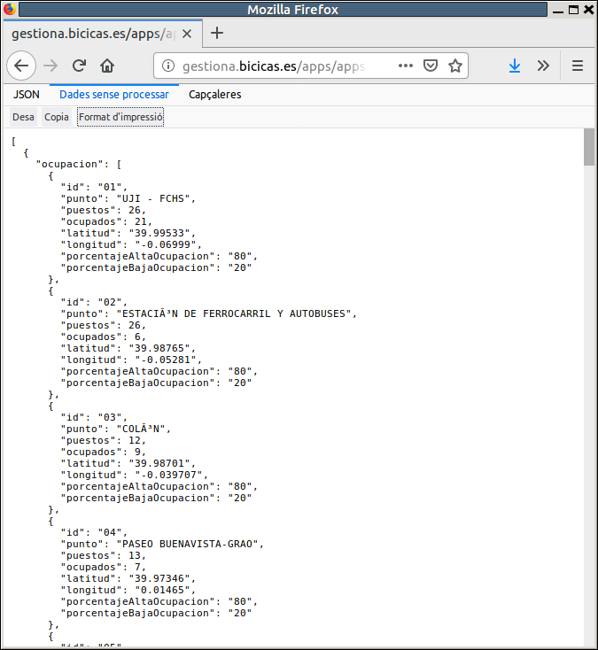

# 5.- Documents JSON

**JSON** vol dir **J** ava**S** cript **O** bject **N****otation** , és a dir
Notació d'Objectes de JavaScript. És una manera de representar objectes
inicialment per a JavaScript, però per la seua senzillesa, i com és en text
pla, serveix per a qualsevol entorn. Permet representar estructures de dades
d'una determinada complexitat, com el XML, però pesa molt menys que aquest, i
per això està convertint-se en un estàndar d'intercanvi de dades, sobretot
entre un servidor i una aplicació web.

L'extensió d'un fitxer JSON és **.json**


## 5.1 - Estructura JSON

Amb JSON podrem representar:

  * **Valors** , de tipus **caràcter** (entre cometes dobles), **numèric** (sense cometes) , **booleà** (true o false) o **null**.
  * **Parelles clau valor** , és a dir un nom simbòlic acompanyat d'un valor associat.. Es representen així: **"nom" : valor**
  * **Objectes** , que és una col·lecció de membres, cadascú dels quals pot ser una parella clau valor, o altres objectes (fins i tot arrays): es representen entre claus, i amb els elements separats per comes: **{ "nom1" : "valor1" , "nom2": valor2 , valor 3 , ... }**
  * **Arrays** , que són llistes d'elements. Els elements no tenen per què tenir la mateixa estructura, però nosaltres intentarem que sí que la tinguen per coherència. Cada element pot ser un valor , una parella clau valor, un objecte o un array.

Veja'm algun exemples:
```
{ "p1" : 2 , "p2" : 4 , "p3" : 6 , "p4" : 8 , "p5" : 10 }
```
en aquest cas tenim un objecte, l'arrel, que té 5 membres, tots ells parelles
clau-valor.
```
{  
"num": 1 ,  
"nom": "Andreu" ,  
"departament": 10 ,  
"edat": 32 ,  
"sou": 1000.0  
}
```
ara un objecte, l'arrel, també amb 5 membres que són parelles clau-valor.
Observeu com la clau sempre la posem entre cometes, i el valor quan és un
string també, però quan és numèric, no.
```
{ "empleat" :  
  { "num": 1 ,  
    "nom": "Andreu" ,  
    "departament": 10 ,  
    "edat": 32 ,  
    "sou": 1000.0  
  }  
}
```
en aquest cas tenim un objecte, l'arrel que consta d'un únic objecte,
**empleat** , el qual consta de 5 membres clau-valor.

Mirem ara un exemple amb un array:
```
{ "notes" :  
  [ 5 , 7 , 8 , 7 ]  
}
```
on tenim l'element arrel que consta d'un únic membre, notes, que és un array.

També seria correcte d'aquesta manera, per veure que l'element arrel no té
perquè ser un objecte, sinó també un array
```
[ 5 , 7 , 8 , 7 ]
```
I ara un més complet amb la mateixa estructura que el fitxer XML que havíem
vist en la pregunta 4. Tindrem un objecte arrel, amb només un objecte,
**empresa** , que té un únic element **empleat** que és un array amb 4
elements, cadascun dels empleats:
```
{ "empresa":  
  { "empleat":  
    [ {  
        "num": "1",  
        "nom": "Andreu",  
        "departament": "10",  
        "edat": "32",  
        "sou": "1000.0"  
      },  
      {  
        "num": "2",  
        "nom": "Bernat",  
        "departament": "20",  
        "edat": "28",  
        "sou": "1200.0"  
      },  
      {  
        "num": "3",  
        "nom": "Clàudia",  
        "departament": "10",  
        "edat": "26",  
        "sou": "1100.0"  
      },  
      {  
        "num": "4",  
        "nom": "Damià",  
        "departament": "10",  
        "edat": "40",  
        "sou": "1500.0"  
      }  
    ]  
  }  
}
```
Anem a veure un parell de casos més reals. Aquesta és la contestació que fa el
WebService de **Bicicas** en sol·licitar l'estat actual de bicicletes en els
diferents punts (en el moment de fer els apunts es consulta en l'adreça
<http://gestiona.bicicas.es/apps/apps.php>):
```
[  
  {"ocupacion":  
    [  
      {"id":"01","punto":"UJI -
FCHS","puestos":27,"ocupados":12,"latitud":"39.99533","longitud":"-0.06999",
"porcentajeAltaOcupacion":"80","porcentajeBajaOcupacion":"20"},  
      {"id":"02","punto":"ESTACIÓN DE FERROCARRIL Y
AUTOBUSES","puestos":24,"ocupados":7,"latitud":"39.98765","longitud":"-0.05281",
"porcentajeAltaOcupacion":"80","porcentajeBajaOcupacion":"20"},  
      {"id":"03","punto":"PLAZA DE
PESCADERÍA","puestos":28,"ocupados":4,"latitud":"39.98580","longitud":"-0.03798",
"porcentajeAltaOcupacion":"80","porcentajeBajaOcupacion":"20"},  
      ...  
    ]  
  }  
]
```
Com podeu comprovar, l'arrel no és un objecte, sinó un **Array**. En l'array
només ens interessa el primer element que és un objecte amb un únic membre,
**ocupacion**(en l'exemple no hi ha més elements, però en poden haver més en
un moment determinat, quan volen fer avisos). I **ocupacion és un array** ,
amb **un objecte per cada estació de bicicas** , amb les parelles clau valor
**id** , **punto** , **puestos** (les bicicletes que caben), **ocupados**
(quantes bicicletes hi ha col·locades en aquest moment), **latitud** i
**longitud** (les coordenades), ...

**Nota**
<div style="background-color: #d6eaf8; color: black; padding: 5px;">
En realitat ens apareixerà tota la informació molt més apegada, perquè
realment està en una única línia.

Per a poder observar millor l'estructura podem utilitzar un <b>visor</b> de json.
Normalment el navegador Firefox els visualitza bé, encara que també depén de
la versió. Si tenim instal·lada una versió que admet la visualització de JSON,
ho intentarà interpretar, encara que segurament la millor manera de veure el
format JSON és,tiar les opcions <b>Dades sense processar -- > Format
d'impressió</b>, que és la que veiem a la dreta:
</div>
<p></p>
 |   
---|---  
<div style="background-color: #d6eaf8; color: black; padding: 5px;">  
Si la versió nostra de Firefox no visualitza el format JSON, podem buscar un
visor dels molts que hi ha per internet. En la figura n'hem utilitzat un, i es
pot observar com facilita molt la lectura.
</div>
<p></p>


Un altre exemple. Un WebService de GeoNames (una Base de Dade geogràfica
gratuïta i accessible a través d'Internet) ens proporciona informació dels
llocs que troba dins d'un rectangle delimitat per un latitud al nord i al sud,
i una longitud a l'esti a l'oest (en l'exemple: nord 40.01, sud 39.9, est 0.1
i oest -0.1). Per exemple,
[http://api.geonames.org/citiesJSON?north=40.01&south=39.99&east=0.01&west=-0.01&lang=ES&username=demo](https://maps.googleapis.com/maps/api/geocode/json?latlng=40,0)
torna el següent:

```    
    
    {
      "geonames": [
        {
          "lng": -0.04935,
          "geonameId": 2519752,
          "countrycode": "ES",
          "name": "Castelló de la Plana",
          "fclName": "city, village,...",
          "toponymName": "Castelló de la Plana",
          "fcodeName": "seat of a second-order administrative division",
          "wikipedia": "en.wikipedia.org/wiki/Castell%C3%B3n_de_la_Plana",
          "lat": 39.98567,
          "fcl": "P",
          "population": 180005,
          "fcode": "PPLA2"
        },
        {
          "lng": -0.06313,
          "geonameId": 2521909,
          "countrycode": "ES",
          "name": "Almazora",
          "fclName": "city, village,...",
          "toponymName": "Almassora",
          "fcodeName": "populated place",
          "wikipedia": "en.wikipedia.org/wiki/Almassora",
          "lat": 39.94729,
          "fcl": "P",
          "population": 24963,
          "fcode": "PPL"
        },
        ...
        ]
    }
```
A partir de l'arrel (que ara sí que és un objecte), tenim un membre:
**geonames**, que és un array (un element per cada "lloc" trobat), on cada
element té informació diversa, com el nom del lloc, les coordenades, la
població, ...

**<u>Nota</u>**
<div style="background-color: #d6eaf8; color: black; padding: 5px;">  
De fa uns mesos que Google limita el servei anterior, i ha de ser amb un
usuari validat. No valdrà la pena, per al poc profit que li trauríem. Mostrem
en què consisteix el servei únicament a nivell il·lustratiu
</div>
<p></p>


## 5.2 Driver org.json

Hi ha més d'una llibreria per a poder accedir i analitzar els documents json.

Per exemple, es comenten prou per Internet són **GSON** (de Google) i
**Jackson**.

Però nosaltres anem a utilitzar dues altres llibreries

  * Una, la del grup **org.json** que en principi serà la mateixa que s'utilitzarà en Android
  * Una altra, la de **Moshi** , que ens permetrà elaborar més el resultat ja que podrem fer una conversió entre Json i objectes de Java o de Kotlin

Pel que fa a la primera, en el moment de fer aquestos apunts l'última versió
estable és la **20210307** , és a dir, de juliol de 2018. En aquest enllaç
teniu d'on us la podeu baixar: <https://jar-
download.com/artifacts/org.json/json/20210307>. Una vegada baixada l'haurem
d'incorporar al nostre projecte (sobre el projecte **F4 -- > Modules -->
pestanya dependencies --> +**)

En ella trobem el més bàsic:

  * **JSONObject** : equivaldrà a un objecte
  * **JSONArray** : equivaldrà a un array
  * **JSONTokener** :ens permetrà analitzar el document Json, i tornarà l'objecte arrel. El mètode que utilitzarem serà sempre **nextValue()**.


### 5.2.1 - Lectura

```JSONTokener```

El primer que haurem de fer serà analitzar el document per a obtenir l'element
arrel (que com hem vist normalment serà un objecte, però de vegades pot ser un
array).

El constructor de **JSONTokener** admet un **String** , amb la qual cosa
analitzarem una cadena que posem directament, o també un **InputStream** o un
**Reader** , amb la qual cosa podrem analitzar directament el contingut d'un
fitxer

El mètode **nextValue()** de **JSONTokener** tornarà l'arrel del document
Json, i només haurem de fer un cast a l'ojecte que és l'arrel: un
**JSONObject** o un **JSONArray**

En el següent exemple agafem el json directament d'un **string** , on teníem
els números parells.
```
{ "p1" : 2 , "p2" : 4 , "p3" : 6 , "p4" : 8 , "p5" : 10 }
```
Observeu com per a la definició del String ens ha tocat escapar les dobles
cometes. Copieu el següent codi en el fitxer
Kotlin**Exemple_3_5_11_JSONAnalitzarCadena.kt**

    
    
    package exemples
    
    import org.json.JSONTokener
    import org.json.JSONObject
    
    fun main(args: Array<String>) {
    
        val cadena = "{ \"p1\" : 2 , \"p2\" : 4 , \"p3\" : 6 , \"p4\" : 8 , \"p5\" : 10 }"
    
        val arrel = JSONTokener(cadena).nextValue() as JSONObject
    
        println(arrel.get("p1"))
    }

Mentre que en aquest exemple accedim al fitxer **parelles.json** (que
assumirem que té el mateix contingut). Podríem passar el contingut del fitxer
a una cadena, però és molt més còmode passar el **Reader** com paràmetre en el
constructor, i ell s'encarrega de llegir-lo tot. Copieu el següent codi en el
fitxer **Exemple_3_5_12_JSONAnalitzarFitxer.kt** :

    
    
    package exemples
    
    import org.json.JSONTokener
    import org.json.JSONObject
    import java.io.FileReader
    
    fun main(args: Array<String>) {
    
        val r_json = FileReader("parelles.json")
    
        val arrel = JSONTokener(r_json).nextValue() as JSONObject
    
        println(arrel.get("p3"));
    }

```JSONObject```

Contindrà un **objecte json**. Recordeu que l'**objecte** es delimita amb les
claus: **{ }**

El mètode més important serà **get(_clau_)** al qual li passem la clau del
membre que volem obtenir. Si el membre és una parella clau-valor, obtindrem
directament el valor. Si és un altre objecte, doncs obtindrem l'objecte o
també podria ser un array. El cas que siga una parella clau-valor, ja l'hem
vist en l'exemple anterior.

En el següent exemple, en el fitxer **Empleat.json** tindrem un empleat
```
{ "empleat" :  
    { "num": 1 ,  
      "nom": "Andreu" ,  
      "departament": 10 ,  
      "edat": 32 ,  
      "sou": 1000.0  
    }  
}
```
Observeu com ara de l'element arrel hem d'agafar **empleat** , que és un
objecte amb les parelles clau-valor **num** , **nom** , ....

Copieu el segúent codi en el fitxer Kotlin
**Exemple_3_5_13_JSONAnalitzarEmpleat.kt** :

    
    
    package exemples
    
    import org.json.JSONTokener
    import org.json.JSONObject
    import java.io.FileReader
    
    fun main(args: Array<String>) {
    
        val r_json = FileReader("Empleat.json")
    
        val arrel = JSONTokener(r_json).nextValue() as JSONObject
    
        val empleat = arrel.get("empleat") as JSONObject
    
        println("" + empleat.get("nom") + " (" + empleat.get("sou") + ")")
    }

També podem utilitzar els mètodes **getJSONObject()** , **getJSONArray** ,
**getInt()** , **getString()** , ..., que directament ens ho dóna en el tipus
especificat, i no cal fer cast.

```JSONArray```

Serà l'array, que recordem que ve limitat per els claudàtors: **[ ]**

Per a obtenir els elements de l'array utilitzarem el mètode **get(_index_)**,
on l'índex és el**número d'ordre** de l'element que volem obtenir.

També tindrem els mètodes **getJSONObject(_index_)**,
**getJSONArray(_index_)**, **getInt(_index_)**, ..., que tornen directament el
tipus especificat

Posem el primer exemple sobre un json que només té un array els elements del
qual són valors:
```
[ 5 , 7 , 8 , 7 ]
```
Observeu com ara l'arrel és un Array, i ens muntem un bucle per obtenir tots
els elements. Copieu el següent codi en el fitxer
**Exemple_3_5_14_JSONAnalitzarArray.kt**

    
    
    package exemples
    
    import org.json.JSONTokener
    import org.json.JSONArray
    
    fun main(args: Array<String>) {
    
        val cadena = "[ 5 , 7 , 8 , 7 ]"
    
        val arrel = JSONTokener(cadena).nextValue() as JSONArray
    
        for (i in arrel)
            println(i)
    }

Com veieu podem fer servir els bucles foreach, però lamentablement no podem
obtenir directament un JsonObject, i per tant l'hem de reconvertir. Ho
mostrarem en el següent exemple en el qual agafem tots els empleats de
l'empresa, on **Empresa.json** és així:
```
{ "empresa" :  
    { "empleats":  
      [  
        { "num":1, "nom": "Andreu", "departament": 10, "edat": 32, "sou": 1000.0} ,  
        { "num":2, "nom": "Bernat", "departament": 20, "edat": 28, "sou": 1200.0} ,  
        { "num":3, "nom": "Clàudia", "departament": 10, "edat": 26, "sou": 1100.0} ,  
        { "num":4, "nom": "Damià", "departament": 10, "edat": 40, "sou": 1500.0}  
       ]  
    }     
}
```
Tindrem un objecte arrel, amb només un objecte, **empresa** , que té un únic
membre empleat que és un array amb 4 elements, cadascun dels empleats. Copieu
el següent exemple en el fitxer kotlin
**Exemple_3_5_15_JSONAnalitzarEmpresa.kt**

    
    
    package exemples
    
    import org.json.JSONTokener
    import org.json.JSONObject
    import java.io.FileReader
    
    fun main(args: Array<String>) {
    
        val r_json = FileReader("Empresa.json")
    
        val arrel = JSONTokener(r_json).nextValue() as JSONObject
        val empresa = arrel.getJSONObject("empresa")
    
        for (e in empresa.getJSONArray("empleats")){
            val emp = e as JSONObject
            println("" + emp.get("nom") + " (" + emp.get("sou") + ")")
        }
    }

Mireu com ens hem estalviat un pas, i no hem definit la variable **empleats**
, sinó que ho especifiquem en el bucle. També podríem haver estalviat la
variable **empresa** si en el bucle haguérem posat :

``` 
    for (e in arrel.getJSONObject("empresa").getJSONArray("empleats")){
```
```Exemple més complet```

Mirem algun exemple ja més elaborat, on ens tocarà analitzar amb detall
l'estructura json. Fem-lo sobre l'exemple de **BICICAS**. Podeu tornar a fer
la consulta de l'estat actual en aquest moment a la pàgina
<http://gestiona.bicicas.es/apps/apps.php> , seleccionar-ho tot i guardar-lo
en el fitxer **Bicicas.json**. És molt possible que tinguem problemes amb els
caràcers especials, com les vocals accentuades, a causa de que el navegador
utilitzat no les reconega, i en copiar-les al fitxer no tinguem ja la
codificació correcta. No li donarem importància en aquest moment. Recordem ací
l'estructura:
```
[  
    {"ocupacion":  
        [   {"id":"01","punto":"UJI - FCHS","puestos":28,"ocupados":11,"latitud":"39.99533",       "longitud":"-0.06999", "porcentajeAltaOcupacion":"80","porcentajeBajaOcupacion":"20"},  
            {"id":"02","punto":"ESTACIÓN DE FERROCARRIL Y AUTOBUSES","puestos":28,"ocupados":8,"latitud":"39.98765", "longitud":"-0.05281","porcentajeAltaOcupacion":"80",  porcentajeBajaOcupacion":"20"},  
            {"id":"03","punto":"PLAZA DE PESCADERÍA","puestos":28,"ocupados":13,"latitud":"39.98580","longitud":"-0.03798", porcentajeAltaOcupacion":"80","porcentajeBajaOcupacion":"20"},  
    ...  
        ]  
    }  
]
```
Com podem observar, comença per un **array** , no per un objecte, com sol ser
habitual. L'únic que ens interessa és el **primer element** de l'array, ja que
en posteriors anirien en tot cas missatges. El primer element és un
**objecte** que té un únic membre **ocupacion** (o si en té més no ens
interessen), que és un **array** amb totes les estacions. Cada estació és un
objecte amb la informació que ens interessa.

Copieu el següent codi en el fitxer Kotlin
**Exemple_3_5_16_JSONAnalitzarBicicas.kt** :
  
    
    package exemples
    
    import org.json.JSONTokener
    import org.json.JSONObject
    import org.json.JSONArray
    import java.io.FileReader
    
    fun main(args: Array<String>) {
    
        val r_json = FileReader("Bicicas.json")
    
        val arrel = JSONTokener(r_json).nextValue() as JSONArray
    
        val estacions = arrel.getJSONObject(0).getJSONArray("ocupacion")
    
        for (e in estacions){
            val est = e as JSONObject
            println("" + e.get("id") + ".- " + e.get("punto") + " (" + e.get("ocupados") + "/" + e.get("puestos") + ")")
        }
    }

Hem agafat l'array, d'ell hem agafat el primer objecte i d'ell l'array. I hem
utilitzat un bucle **for** , per a tots els valors de l'array


### 5.2.2 - Escriptura

Ens falta veure com escriure un document JSON. És molt fàcil anar creant
l'estructura JSON. Només hem de recordar la manera d'afegir al **JSONObject**
i al **JSONArray**.

  * **put("nom", element)** per afegir un nou membre a un **JSONObject**
  * **put(element)** per afegir un nou element a un **JSONArray**

**<b>Nota</b>**
<div style="background-color: #d6eaf8; color: black; padding: 5px;">
La major part de drivers utilitzen <b>add(element)<b> per a afegir un element a
un JSONArray, en compte de <b>put</b>
</div>
<p></p>
    

Una vegada tinguem l'estructura, podrem passar-la a un **string** amb el
mètode **toString** , i la podrem guardar directament en un fitxer, per
exemple.

Farem més d'un exemple, per poder practicar.

En el primer exemple generarem un JSON a partir de dades definides en el
mateix programa, per mig de vectors. Intentarem generar aquest fitxer JSON:

```
{ "empresa":  
    { "empleat":  
        [ {  
                "num": "1",  
                "nom": "Andreu",  
                "departament": "10",  
                "edat": "32",  
                "sou": "1000.0"  
           },  
           {  
                "num": "2",  
                "nom": "Bernat",  
                "departament": "20",  
                "edat": "28",  
                "sou": "1200.0"  
            },  
            {     
                "num": "3",  
                "nom": "Clàudia",  
                "departament": "10",  
                "edat": "26",  
                "sou": "1100.0"  
            },  
            {  
                "num": "4",  
                "nom": "Damià",  
                "departament": "10",  
                "edat": "40",  
                "sou": "1500.0"  
            }  
        ]  
    }  
}
```
Analitzem l'estructura. Tenim un objecte arrel, que consta d'un únic membre,
empresa, que és un objecte. Aquest objecte té un únic membre que és un array.
Cada element de l'array és un objecte, i els seus membres ja són clau-valor.

Copieu el següent codi en el fitxer kotlin
**Exemple_3_5_17_JSONEscriureEmpleats.kt** :

        
    import org.json.JSONObject
    import org.json.JSONArray
    import java.io.FileWriter
    
    fun main(args: Array<String>) {
    	val noms = arrayOf("Andreu", "Bernat", "Clàudia", "Damià")
    	val departaments = arrayOf( 10, 20, 10, 10 )
    	val edats = arrayOf( 32, 28, 26, 40 )
    	val sous = arrayOf( 1000.0, 1200.0, 1100.0, 1500.0)
    
    	val arrel = JSONObject()
    	val empresa = JSONObject()
    	arrel.put("empresa", empresa)
    	val empleats = JSONArray()
    	empresa.put("empleat", empleats)
    
    	for (i in 0..3){
    		val emp = JSONObject()
    		emp.put("num", i + 1)
    		emp.put("nom", noms[i])
    		emp.put("departament", departaments[i])
    		emp.put("edat", edats[i])
    		emp.put("sou", sous[i])
    		empleats.put(emp)
    	}
    
    	val f = FileWriter("Empleats.json")
    	f.write(arrel.toString(4))
    	f.close()
    }

Hem posat en el moment de passar el JSONObject a String el paràmetre 4, per a
que idente en diferents linies a 4 espais. Com veureu el resultat és quasi
perfecte
```
       
    {"empresa": {"empleat": [
        {
            "num": 1,
            "sou": 1000,
            "nom": "Andreu",
            "edat": 32,
            "departament": 10
        },
        {
            "num": 2,
            "sou": 1200,
            "nom": "Bernat",
            "edat": 28,
            "departament": 20
        },
        {
            "num": 3,
            "sou": 1100,
            "nom": "Clàudia",
            "edat": 26,
            "departament": 10
        },
        {
            "num": 4,
            "sou": 1500,
            "nom": "Damià",
            "edat": 40,
            "departament": 10
        }
    ]}}
```
Tenim el problema aparent que els membres de cada empleat estan
**desordenats**. No és que haja eixit malament, perquè hem de recordar que un
objecte JSON és un conjunt no ordenat de membres.

```Exemple BICICAS```

Un altre exemple, el de **Bicicas** , i el que farem per a practicar tant la
lectura com l'escriptura, serà donar-li una altra estructura. Per tant
llegirem l'original, i anirem construint la següent estructura en què està la
informació més resumida:
```
{ "bicicas":  
  [ {"num":"01","nom":"UJI - FCHS","llocs":28,"ocupats":11,"lliures":17},  
    {"num":"02","nom":"ESTACIÓN DE FERROCARRIL Y AUTOBUSES","llocs":28,"ocupats":8,"lliures":20},  
    {"num":"03","nom":"PLAZA DE PESCADERÍA","llocs":28,"ocupats":13,"lliures":15},  
        ...  
  ]  
}
```
Tindrem per una banda les estacions d'origen, i per una altra les de destí .

Copieu el següent codi en el fitxer Kotlin
**Exemple_3_5_18_JSONEscriureBicicas.kt** :

       
    import org.json.JSONTokener
    import org.json.JSONObject
    import org.json.JSONArray
    import java.io.FileReader
    import java.io.FileWriter
    
    fun main(args: Array<String>) {
    
    	val r_json = FileReader("Bicicas.json")
    	val arrel = JSONTokener(r_json).nextValue() as JSONArray
    	val estacions = arrel.getJSONObject(0).getJSONArray("ocupacion")
    
    	val destEstacions = JSONArray()	
    
    	for (e in estacions){
    		e as JSONObject
    		val destE = JSONObject();
    		destE.put("num", e.get("id"));
    		destE.put("nom", e.get("punto"));
    		destE.put("llocs", e.get("puestos"));
    		destE.put("ocupats", e.get("ocupados"));
    		val lliures = e.get("puestos") as Int - e.get("ocupados") as Int
    		destE.put("lliures", lliures)
    		destEstacions.put(destE)
    	}
    
    	val bicicas = JSONObject()
    	bicicas.put("bicicas", destEstacions)
    
    	val w_json = FileWriter("Bicicas2.json");
    	w_json.write(bicicas.toString(4));
    	w_json.close();
    }

El resultat seria aquest (observeu que havíem posat una tabulació de 4):

```    
    
    {"bicicas": [
        {
            "num": "01",
            "ocupats": 23,
            "llocs": 28,
            "nom": "UJI - FCHS",
            "lliures": 5
        },
        {
            "num": "02",
            "ocupats": 0,
            "llocs": 28,
            "nom": "ESTACIóN DE FERROCARRIL Y AUTOBUSES",
            "lliures": 28
        },
    ...
    ]}
```

## 5.3 Driver Moshi

El driver anterior tenia un funcionament molt senzill, però que obliga a
seguir en tot moment l'estructura que té el fitxer Json, buscar entre els
objectes i arrays cada vegada que es fa un accés.

Si són relativament pocs els accessos, és molt còmode, però si s'ha de fer un
accés continuat pot resultar més pesat.

Existeix una altra llibreria, que ens permet passar d'un fitxer Json a
objectes de Java o Kotlin, la qual cosa ens anirà bé quan siguen molts els
accessos, perquè en definitiva tindrem les dades en l'entorn natural del
nostre llenguatge: els objectes.

Es tracta de la llibreria **MOSHI** , i aquest és el lloc on poder trobar-la:

<https://github.com/square/moshi>

En el moment de fer aquestos apunts, va per la versió 1.14.0. Tanmateix en les
últimes versions dóna un error de compatibilitat. Ens conformarem per tant amb
una versió anterior. Podem trobar totes les versions en aquest enllaç:

<https://jar-download.com/artifacts/com.squareup.moshi/moshi>

Podem agafar per exemple versió 1.8.0:

<https://jar-download.com/artifacts/com.squareup.moshi/moshi/1.8.0/source-
code>

Veureu que hi ha dos drivers, el propi de **Moshi** i un altre driver anomenat
**okio**. Haurem d'incorporar els dos al nostre projecte.

Recordeu que la manera d'incorporar els drivers al projecte IntelliJ és amb:

**Sobre el projecte F4 (Project Structure) -- > Modules --> pestanya
dependencies --> +**


### 5.3.1 Lectura

Com comentàvem en la pregunta anterior, la llibreria Moshi permet passar d'un
document JSON directament a objectes Java o Kotlin.

Ho mostrarem en dos exemples:

  * Primer per a poder llegir Empresa.json, en què l'element arrel és un objecte Json.
  * Després per a llegir Bicicas,json, en què l'element arrel és un array Json, cosa que ens complica un poc la lectura

```Cas 1: l'arrel és un objecte```

Tant en un com en l'altre primer haurem de crear les classes Java o Kotlin on
anirà la lectura del fitxer. Aquestes classes hauran de tenir la mateixa
estructura que en JSON, però adaptades a Java o Kotlin.

Anem per tant a analitzar **Empresa.json** , que ja el teníem creat i tenia
aquesta estructura:
```
{ "empresa" :  
    { "empleats":  
            [  
        { "num":1, "nom": "Andreu", "departament": 10, "edat": 32, "sou": 1000.0} ,  
        { "num":2, "nom": "Bernat", "departament": 20, "edat": 28, "sou": 1200.0} ,  
        { "num":3, "nom": "Clàudia", "departament": 10, "edat": 26, "sou": 1100.0} ,  
        { "num":4, "nom": "Damià", "departament": 10, "edat": 40, "sou": 1500.0}  
            ]  
    }  
}
```
També teníem creada la classe Empleat, des de la pregunta 3 d'aquest tema, i
tenia aquesta estructura. **Empleat.kt** :

```
    class Empleat (var num: Int, var nom: String, var departament: Int, var edat: Int, var sou: Double)
```   

L'havíem fet **Serializable** , però això no importa en aquest exemple. El
podem deixar tal qual estava.

L'estuctura del fitxer JSON, ens marca que l'arrel és un **objecte** que té un
únic membre que es diu **empresa** , que és un **objecte** que té un únic
membre anomenat **empleats** , que és un **array** d'objectes (que
coincideixen ja amb la classe **Empleat**).

Per tant ens hem de construir una **classe** que que tinga una propietat
anomenada **empleats** , que siga un conjunt de **Empleat**. Ens vindrà bé un
**List**. Com que la utilitzarem en més d'un exemple, la guardem en el fitxer
de classe **Empleats.kt** ;

```     
    class Empleats(val empleats: List<Empleat> = listOf<Empleat>())
```    

I a partir d'aquesta hem de construir una altra classe que tinga una única
propietat anomenada **empresa** que siga de tipus **Empleats**. Com que la
utilitzarem en més d'un exemple, la guardem en el fitxer de classe
**Empresa.kt**

```
    class Empresa(val empresa: Empleats)
```
La lectura del fitxer la fem a partir d'un objecte **Moshi** al qual per mig
del mètode **adapter** definim quina classe volem llegir. Una vegada llegit ja
podem utilitzar els objectes Java o Kotlin.

Copieu el següent codi en el fitxer Kotlin
**Exemple_3_5_21_MOSHIAnalitzarEmpresa.kt** :

    
    
    package exemples
    
    import com.squareup.moshi.*
    import java.io.File
    
    fun main (args: Array<String>){
        val json = File("Empresa.json").readText()
    
        val moshi = Moshi.Builder().build()
        val adapter = moshi.adapter(Empresa::class.java)
        val empresa = adapter.fromJson(json)
    
        val llEmpleats= empresa!!.empresa.empleats
        println("Hi ha " + llEmpleats.size + " empleats:")
        for (e in llEmpleats)
            println(e.nom + " (" + e.sou  +")")
    }

```Cas 2: l'arrel és un array```

En cas que l'arrel del fitxer JSON siga un array, se'ns complica un poc,
perquè en el moment de definir quina classe volem llegir, no és en realitat
una classe, sinó un col·lecció (un List havíem vist que és el que
utilitzàvem).

Moshi utilitza una tècnica per a poder fer la lectura de l'array, que
consisteix a crear-se un tipus de dades que seria la concatenació d'un List i
de la classe de la qual volem l'array. Ho veurem molt millor en l'exemple.

L'exemple serà per a llegir el fitxer Bicicas.json, que recordem que començava
per un array:
```
[  
    {"ocupacion":  
        [   {"id":"01","punto":"UJI - FCHS","puestos":28,"ocupados":11,"latitud":"39.99533",      "longitud":"-0.06999",  
            "porcentajeAltaOcupacion":"80","porcentajeBajaOcupacion":"20"},  
            {"id":"02","punto":"ESTACIÓN DE FERROCARRIL Y AUTOBUSES","puestos":28,"ocupados":8,"latitud":"39.98765", "longitud":"-0.05281","porcentajeAltaOcupacion":"80","porcentajeBajaOcupacion":"20"},  
            {"id":"03","punto":"PLAZA DE PESCADERÍA","puestos":28,"ocupados":13,"latitud":"39.98580","longitud":"-0.03798",  
            "porcentajeAltaOcupacion":"80","porcentajeBajaOcupacion":"20"},  
            ...  
        ]  
    }  
]

```
Era un array d'un únic element , però en definitiva un array. Només ens
interessa el primer element, que serà un objecte amb un únic membre anomenat
**ocupacion** , que és un array on cada element és un objecte corresponent a
una estació, amb les seues característiques com a parelles clau-valor.

Definim per tant la classe **Estacio.kt** :

```    
    
    class Estacio(
    	val id: Long, val punto: String, val puestos: Int,
    	val ocupados: Int, val latitud: Double, val longitud: Double,
    	val porcentajeAltaOcupacion: Int, val porcentajeBajaOcupacion: Int
    )
```
I la classe **Estacions.kt**:

```    
    class Estacions(val ocupacion: List<Estacio> = listOf<Estacio>())
```
Copieu el següent codi en un fitxer Kotlin anomenat
**Exemple_3_5_22_MOSHIAnalitzarBicicas.kt** :

    
    
    package exemples
    
    import com.squareup.moshi.*
    import java.io.File
    
    fun main(args: Array<String>) {
        val json = File("Bicicas.json").readText()
    
        val moshi = Moshi.Builder().build()
        val llistaTipus = Types.newParameterizedType(List::class.java, Estacions::class.java)
        val adapter: JsonAdapter<List<Estacions>> = moshi.adapter(llistaTipus)
        val bicicas = adapter.fromJson(json)
    
        val estacions = bicicas!!.get(0).ocupacion
        println("Hi ha " + estacions.size + " estacions:")
        for (e in estacions)
            println("" + e.id + ": " + e.punto + " (" + e.ocupados + "/" + e.puestos + ")")
    }

### 5.3.2 Escriptura

També farem 2 exemples d'escriptura, el d'Empleats i el de Bicicas, els
mateixos que en la pregunta 5.2.2

```Cas 1: Empleats```

Per a **Empleats.json** aquest és l'estructura que volem aconseguir:
```
{ "empresa":  
    { "empleat":  
        [  {  
                "num": "1",  
                "nom": "Andreu",  
                "departament": "10",  
                "edat": "32",  
                "sou": "1000.0"  
            },  
            {  
                "num": "2",  
                "nom": "Bernat",  
                "departament": "20",  
                "edat": "28",  
                "sou": "1200.0"  
            },  
            {  
                "num": "3",  
                "nom": "Clàudia",  
                "departament": "10",  
                "edat": "26",  
                "sou": "1100.0"  
            },  
            {  
                "num": "4",  
                "nom": "Damià",  
                "departament": "10",  
                "edat": "40",  
                "sou": "1500.0"  
            }  
        ]  
    }  
}
```
L'estructura de les classes serà la mateixa que en el cas de la lectura, però
ara les dades estaran definides en 4 arrays. A partir dels arrays
inicialitzarem els objectes Kotlin, i quan ho tinguem tot ple passarem a JSON.

NO HEM DE DEFINIR LES CLASSES, ja que les tenim definides des punt 5.3.1. Les
posem ací únicament per a il·lustrar:

```    
    class Empleat (var num: Int, var nom: String, var departament: Int, var edat: Int, var sou: Double)
    
    
    class Empleats(val empleats: List<Empleat> = listOf<Empleat>())
    
    
    class Empresa(val empresa: Empleats)

```
Aleshores, inicialitzem els objectes a partir de les dades que tenim en els 4
arrays, i després **guardem** en JSON. Mireu que la definició de les classes
de **Moshi** és la mateixa, però ara utilitzem el mètode **toJson()** per a
passar d'objectes Kotlin a JSON. Obtenim un String que és la cadena JSON, i
senzillament l'escrivim en un fitxer.

Copieu el següent codi en un fitxer Kotlin anomenat
**Exemple_3_5_23_MOSHIEscriureEmpleats.kt** :

    
    
    package exemples
    
    import com.squareup.moshi.*
    import java.io.File
    
    fun main (args: Array<String>){
        val noms = arrayOf("Andreu", "Bernat", "Clàudia", "Damià")
        val departaments = arrayOf(10, 20, 10, 10)
        val edats = arrayOf(32, 28, 26, 40)
        val sous = arrayOf(1000.0, 1200.0, 1100.0, 1500.0)
    
        val empleats = arrayListOf<Empleat>()
        for (i in 0..3)
            empleats.add(Empleat((i+1),noms[i],departaments[i],edats[i],sous[i]))
    
        val empresa = Empresa(Empleats(empleats))
    
        val moshi = Moshi.Builder().build()
        val adapter = moshi.adapter(Empresa::class.java)
        val json = adapter.toJson(empresa)
    
        File("Empleats2.json").writeText(json)
    
    }

```Cas 2: Bicicas```

Farem el mateix exercici que en l'apartat 5.2.2, però ara utilitzant la
llibreria **Moshi**.

Voldrem aconseguir aquesta estructura i guardar-la en el fitxer
```
{ "bicicas":  
    [   {"num":"01","nom":"UJI - FCHS","llocs":28,"ocupats":11,"lliures":17},  
        {"num":"02","nom":"ESTACIÓN DE FERROCARRIL Y AUTOBUSES","llocs":28,"ocupats":8,"lliures":20},  
        {"num":"03","nom":"PLAZA DE PESCADERÍA","llocs":28,"ocupats":13,"lliures":15},  
        ...  
    ]  
}
```
Tindrem per una banda l'estructura d'origen, per a la qual utilitzem les
classes ja definides en l'apartat 5.3.1, és a dir, per a llegir el fitxer
Bicicas.json original fem el mateix que l'altra vegada, per tant serà copiar
les primeres sentències del programa
**Exemple_3_5_22_MOSHIAnalitzarBicicas.kt** .

A partir dels objectes inicialitzats amb la lectura de Bicicas.json,
construirem els objectes que ens serviran per a l'escriptura. L'estructura
d'aquestes classes que ens serviran per a l'escriptura seran:

```    
    
    class EstDesti (val num: Int, val nom: String, val llocs: Int, val ocupats: Int, val lliures: Int)
    
    class Bicicas2 (val bicicas: List<EstDesti>)
```
Per comoditat, com que només anem a utilitzar-les en aquesta ocasió, les
definirem en el mateix fitxer del programa.

Observeu com senzillament llegim passant a les classes d'entrada, convertim a
les classes d'eixida, i utilitzem aquestes últimes per escriure el fitxer.

Copieu el següent codi en el fitxer Kotlin anomenat
**Exemple_3_5_24_MOSHIEscriureBicicas.kt** :

    
    
    package exemples
    
    import com.squareup.moshi.*
    import java.io.File
    
    class EstDesti (val num: Int, val nom: String, val llocs: Int, val ocupats: Int, val lliures: Int)
    
    class Bicicas2 (val bicicas: List<EstDesti>)
    
    fun main(args: Array<String>) {
        val json = File("Bicicas.json").readText()
    
        val moshi = Moshi.Builder().build()
        val llistaTipus = Types.newParameterizedType(List::class.java, Estacions::class.java)
        val adapter: JsonAdapter<List<Estacions>> = moshi.adapter(llistaTipus)
        val estacions = adapter.fromJson(json).get(0).ocupacion
    
        val llistaEstDesti = arrayListOf<EstDesti>()
        val bicicas2 = Bicicas2(llistaEstDesti)
        for (e in estacions)
            llistaEstDesti.add(EstDesti(e.id.toInt(),e.punto,e.puestos,e.ocupados,e.puestos-e.ocupados))
    
        val adapter2 = moshi.adapter(Bicicas2::class.java)
        val json2 = adapter2.toJson(bicicas2)
    
        File("Bicicas2.json").writeText(json2)
    }

Segurament aquesta estructura és la més coherent. Amb la finalitat únicament
d'escriure un JSON que té com a arrel un array i no un objecte, anem a ferun
altre exemple en el qual guardarem en un fitxer aquesta estructura:
```
[  
    {"num":"01","nom":"UJI - FCHS","llocs":28,"ocupats":11,"lliures":17},  
    {"num":"02","nom":"ESTACIÓN DE FERROCARRIL Y AUTOBUSES","llocs":28,"ocupats":8,"lliures":20},  
    {"num":"03","nom":"PLAZA DE PESCADERÍA","llocs":28,"ocupats":13,"lliures":15},  
    ...  
]
```
En aquesta ocasió tenim només un array d'objectes.

L'única estructura d'eixida que ens cal és la classe **EstDesti** , ja
definida en l'exercici anterior, i per tant ara no caldrà definir-la. Només
hem d'anar amb compte amb l'estructura d'eixida, que ara no serà una classe
sinó una combinació de **List** i **EstDesti**.

Copieu el següent codi en el fitxer Kotlin
**Exemple_3_5_25_MOSHIEscriureBicicas3.kt** :

    
    
    package exemples
    
    import com.squareup.moshi.*
    import java.io.File
    
    fun main(args: Array<String>) {
        val json = File("Bicicas.json").readText()
    
        val moshi = Moshi.Builder().build()
        val llistaTipus = Types.newParameterizedType(List::class.java, Estacions::class.java)
        val adapter: JsonAdapter<List<Estacions>> = moshi.adapter(llistaTipus)
        val estacions = adapter.fromJson(json).get(0).ocupacion
    
        val llistaEstDesti = arrayListOf<EstDesti>()
        for (e in estacions)
            llistaEstDesti.add(EstDesti(e.id.toInt(),e.punto,e.puestos,e.ocupados,e.puestos-e.ocupados))
    
        val llistaTipusDesti = Types.newParameterizedType(List::class.java, EstDesti::class.java)
        val adapter2: JsonAdapter<List<EstDesti>> = moshi.adapter(llistaTipusDesti)
        val json2 = adapter2.toJson(llistaEstDesti)
    
        File("Bicicas3.json").writeText(json2)
    }


Llicenciat sota la  [Llicència Creative Commons Reconeixement NoComercial
CompartirIgual 2.5](http://creativecommons.org/licenses/by-nc-sa/2.5/)

